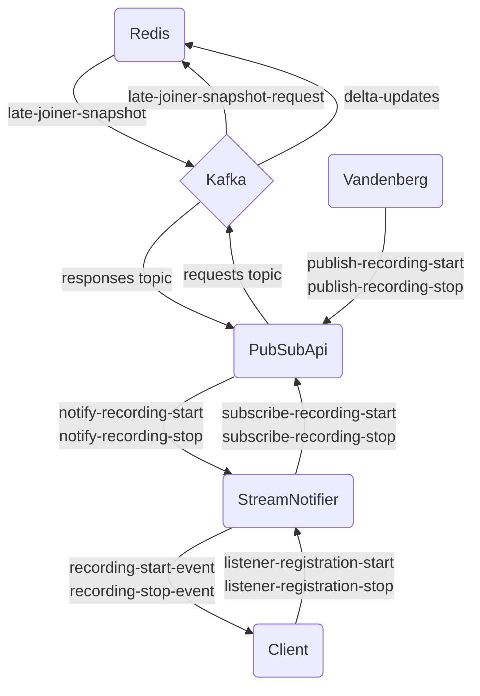

## Async notifications architecture

```mermaid
flowchart TD
    Redis_(Redis) -->|late-joiner-snapshot|Kafka_
    Kafka_ -->|late-joiner-snapshot-request|Redis_
    Kafka_ -->|delta-updates|Redis_
    Kafka_{Kafka} -->|responses topic|PubSubApi_(PubSubApi)
    PubSubApi_ -->|requests topic|Kafka_
    Vandenberg_(Vandenberg) -->|publish-recording-start<br>publish-recording-stop| PubSubApi_
    PubSubApi_ -->|notify-recording-start<br>notify-recording-stop| StreamNotifier_(StreamNotifier)
    StreamNotifier_ -->|subscribe-recording-start<br>subscribe-recording-stop| PubSubApi_
    Client_(Client) -->|listener-registration-start<br>listener-registration-stop| StreamNotifier_
    StreamNotifier_ -->|recording-start-event<br>recording-stop-event| Client_
```
 
