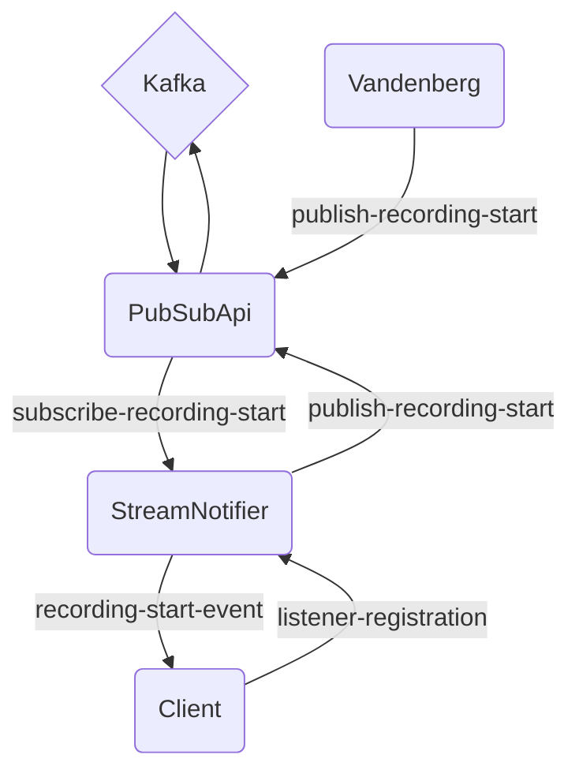

## Async notifications architecture

```mermaid
flowchart TD
    Kafka_{Kafka} -->PubSubApi_(PubSubApi)
    PubSubApi_ -->Kafka_
    Vandenberg_(Vandenberg) -->|publish-recording-start| PubSubApi_
    PubSubApi_ -->|subscribe-recording-start| StreamNotifier_(StreamNotifier)
    StreamNotifier_ -->|publish-recording-start| PubSubApi_
    Client_(Client) -->|listener-registration| StreamNotifier_
    StreamNotifier_ -->|recording-start-event| Client_
```
 
