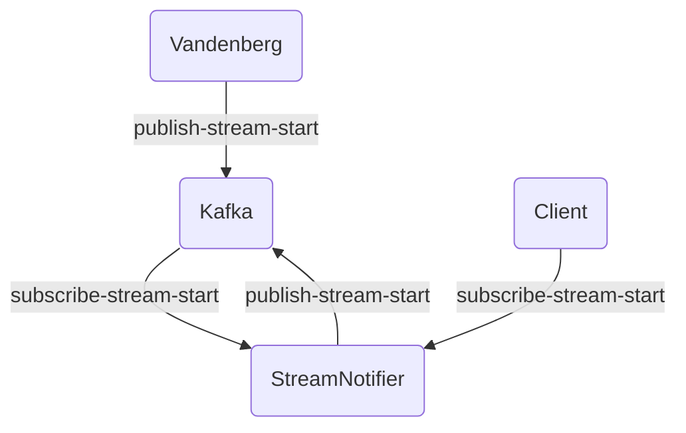

## Async notifications architecture

```mermaid
flowchart TD
    Vandenberg_(Vandenberg) -->|publish-stream-start| Kafka_{Kafka}
    Kafka_ -->|subscribe-stream-start| StreamNotifier_(StreamNotifier)
    StreamNotifier_ -->|publish-stream-start| Kafka_(Kafka)
    Client_(Client) -->|subscribe-stream-start| StreamNotifier_
```
 
publish-stream-start: publish stream start notification 
subscribe-stream-start: subscribe for stream start notifications 
