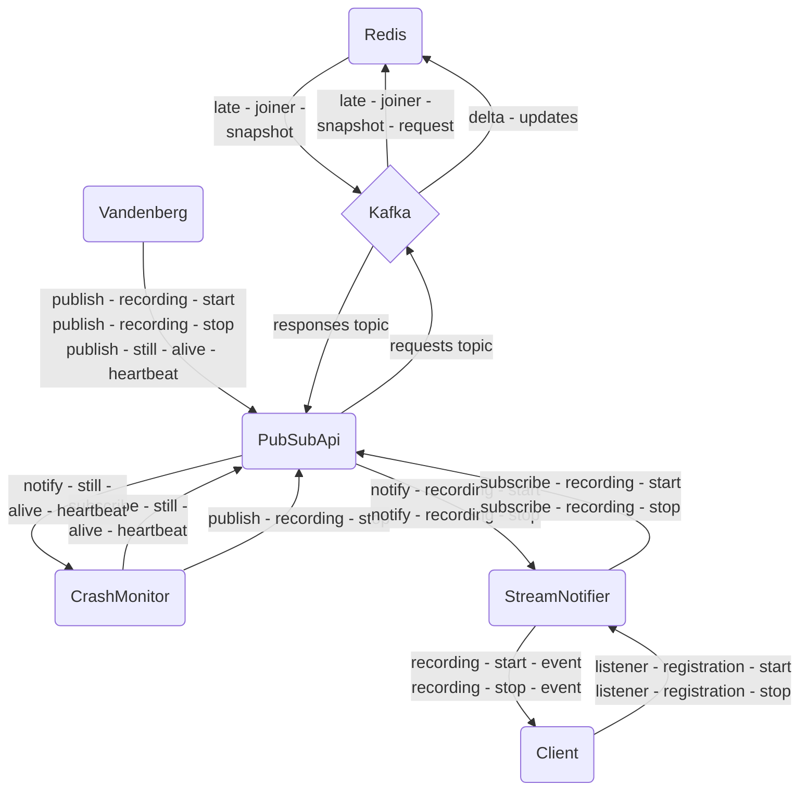

## Async notifications architecture

```mermaid
flowchart TD
    Redis_(Redis) -->|late - joiner - <br>snapshot| Kafka_
    Kafka_ -->|late - joiner - <br>snapshot - request| Redis_
    Kafka_ -->|delta - updates| Redis_
    Vandenberg_(Vandenberg) -->|publish - recording - start<br>publish - recording - stop<br>publish - still - alive - heartbeat| PubSubApi_
    Kafka_{Kafka} -->|responses topic| PubSubApi_(PubSubApi)
    PubSubApi_ -->|requests topic| Kafka_
    CrashMonitor_(CrashMonitor) -->|subscribe - still - <br>alive - heartbeat| PubSubApi_
    CrashMonitor_(CrashMonitor) -->|publish - recording - stop| PubSubApi_
    PubSubApi_ -->|notify - still - <br>alive - heartbeat| CrashMonitor_
    PubSubApi_ -->|notify - recording - start<br>notify - recording - stop| StreamNotifier_(StreamNotifier)
    StreamNotifier_ -->|subscribe - recording - start<br>subscribe - recording - stop| PubSubApi_
    Client_(Client) -->|listener - registration - start<br>listener - registration - stop| StreamNotifier_
    StreamNotifier_ -->|recording - start - event<br>recording - stop - event| Client_
```

 
