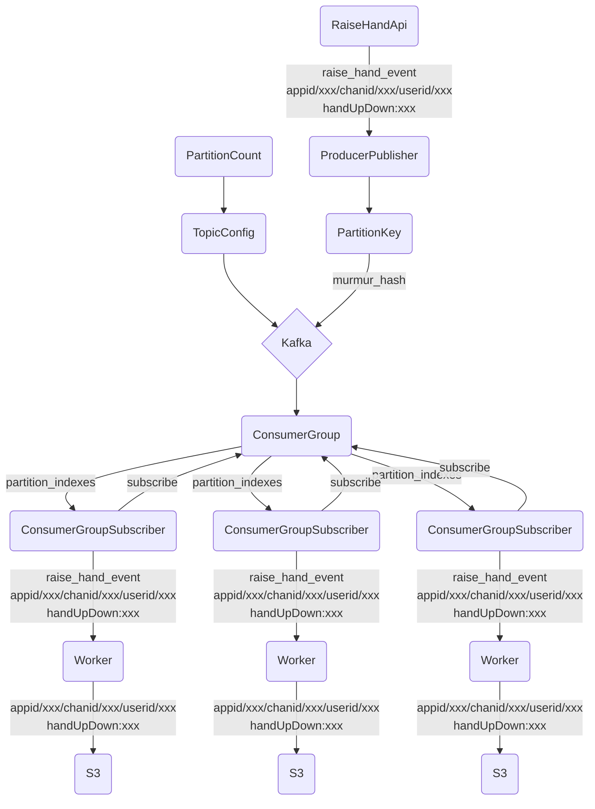

## Kafka Primitives

For example: 
 
PartitionCount, for topic config, is 1000. 
PartitionKey = "appid/123/chanid/322/userid/user42"  (each PartitionKey carries a payload as well)
 
int32 hash = murmur_hash(PartitionKey) 
partition_index = hash % PartitionCount 
 
 
Here we have three workers, so 1000/3 = ~333 partition_indexes per worker.
If worker count increased to 250, that would mean 1000/4 = 250 partitions per worker,
after the ConsumerGroup is rebalanced.
