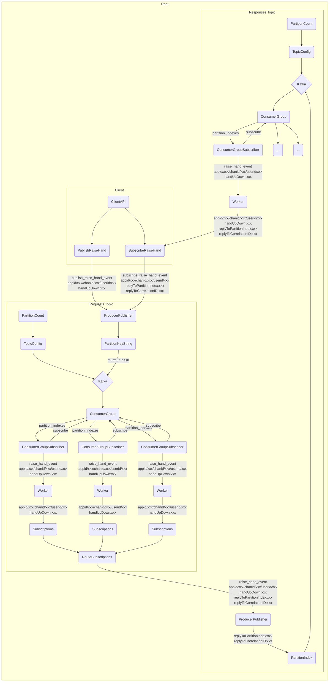

## True Pubsub API, layered on Kafka, aka Omni

```mermaid
flowchart TD
    subgraph Root
        direction TB
        subgraph Client
            ClientAPI_(ClientAPI) --> PublishRaiseHand_
            ClientAPI_ --> SubscribeRaiseHand_
        end
        subgraph Requests Topic
            PartitionCount_(PartitionCount) --> TopicConfig_
            TopicConfig_(TopicConfig) --> Kafka_
            PublishRaiseHand_(PublishRaiseHand) -->|publish_raise_hand_event<br>appid/xxx/chanid/xxx/userid/xxx<br>handUpDown:xxx| Producer_
            SubscribeRaiseHand_(SubscribeRaiseHand) -->|subscribe_raise_hand_event<br>appid/xxx/chanid/xxx/userid/xxx<br>replyToPartitionIndex:xxx<br>replyToCorrelationID:xxx| Producer_
            Producer_(ProducerPublisher) --> PartitionKeyString_
            PartitionKeyString_(PartitionKeyString) -->|murmur_hash| Kafka_{Kafka}
            Kafka_ --> ConsumerGroup_(ConsumerGroup)
            ConsumerGroup_ -->|partition_indexes| ConsumerGroupSubscriber_1(ConsumerGroupSubscriber)
            ConsumerGroup_ -->|partition_indexes| ConsumerGroupSubscriber_2(ConsumerGroupSubscriber)
            ConsumerGroup_ -->|partition_indexes| ConsumerGroupSubscriber_3(ConsumerGroupSubscriber)
            ConsumerGroupSubscriber_1 -->|subscribe| ConsumerGroup_
            ConsumerGroupSubscriber_2 -->|subscribe| ConsumerGroup_
            ConsumerGroupSubscriber_3 -->|subscribe| ConsumerGroup_
            ConsumerGroupSubscriber_1 -->|raise_hand_event<br>appid/xxx/chanid/xxx/userid/xxx<br>handUpDown:xxx| Worker_1(Worker)
            ConsumerGroupSubscriber_2 -->|raise_hand_event<br>appid/xxx/chanid/xxx/userid/xxx<br>handUpDown:xxx| Worker_2(Worker)
            ConsumerGroupSubscriber_3 -->|raise_hand_event<br>appid/xxx/chanid/xxx/userid/xxx<br>handUpDown:xxx| Worker_3(Worker)
            Worker_1 -->|appid/xxx/chanid/xxx/userid/xxx<br>handUpDown:xxx| Subscriptions_1(Subscriptions) --> RouteSubscriptions_2
            Worker_2 -->|appid/xxx/chanid/xxx/userid/xxx<br>handUpDown:xxx| Subscriptions_2(Subscriptions) --> RouteSubscriptions_2
            Worker_3 -->|appid/xxx/chanid/xxx/userid/xxx<br>handUpDown:xxx| Subscriptions_3(Subscriptions) --> RouteSubscriptions_2
        end
        subgraph Responses Topic
            PartitionCount_2(PartitionCount) --> TopicConfig_2
            TopicConfig_2(TopicConfig) --> Kafka_2
            RouteSubscriptions_2(RouteSubscriptions) -->|raise_hand_event<br>appid/xxx/chanid/xxx/userid/xxx<br>handUpDown:xxx<br>replyToPartitionIndex:xxx<br>replyToCorrelationID:xxx| Producer_2
            Producer_2(ProducerPublisher) -->|replyToPartitionIndex:xxx<br>replyToCorrelationID:xxx| PartitionIndex_2
            PartitionIndex_2(PartitionIndex) --> Kafka_2{Kafka}
            Kafka_2 --> ConsumerGroup_2(ConsumerGroup)
            ConsumerGroup_2 -->|partition_indexes| ConsumerGroupSubscriber_21(ConsumerGroupSubscriber)
            ConsumerGroup_2 --> ConsumerGroupSubscriber_22(...)
            ConsumerGroup_2 --> ConsumerGroupSubscriber_23(...)
            ConsumerGroupSubscriber_21 -->|subscribe| ConsumerGroup_2
            ConsumerGroupSubscriber_21 -->|raise_hand_event<br>appid/xxx/chanid/xxx/userid/xxx<br>handUpDown:xxx| Worker_21(Worker)
            Worker_21 -->|appid/xxx/chanid/xxx/userid/xxx<br>handUpDown:xxx<br>replyToPartitionIndex:xxx<br>replyToCorrelationID:xxx| SubscribeRaiseHand_
        end
    end
```

 
