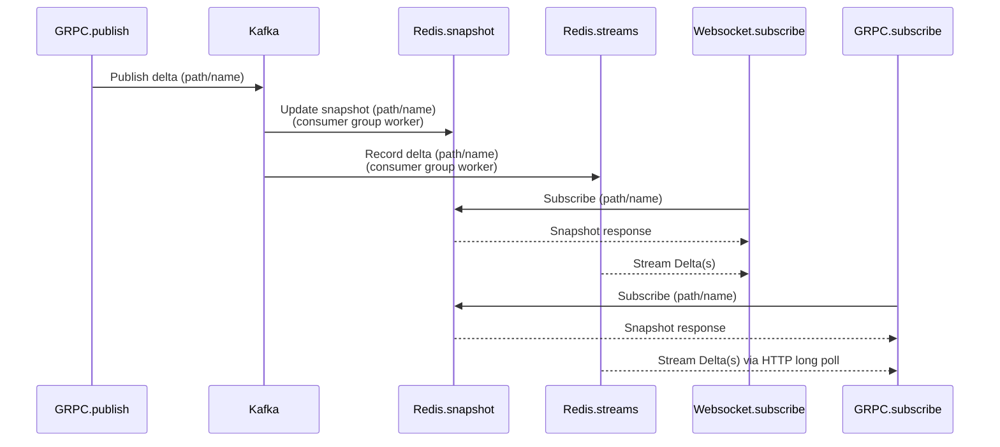

## Async notifications - sequence diagram

```mermaid
sequenceDiagram
    GRPC.publish ->> Kafka: Publish delta (path/name)
    Kafka ->> Redis.snapshot: Update snapshot (path/name)<br>(consumer group worker)
    Kafka ->> Redis.streams: Record delta (path/name)<br>(consumer group worker)
    Websocket.subscribe ->> Redis.snapshot: Subscribe (path/name)
    Redis.snapshot -->> Websocket.subscribe: Snapshot response
    Redis.streams -->> Websocket.subscribe: Stream Delta(s)
    GRPC.subscribe ->> Redis.snapshot: Subscribe (path/name)
    Redis.snapshot -->> GRPC.subscribe: Snapshot response
    Redis.streams -->> GRPC.subscribe: Stream Delta(s) via HTTP long poll
```
** (path/name) equates to the kafka partitionKey, redis hash key (snapshots), and redis stream key (deltas)
