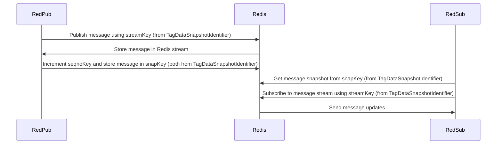

# Architecture Document: RedPub and RedSub

## Overview

The RedPub and RedSub system is designed to publish and subscribe messages in a distributed environment using the Redis datastore. The system uses TagDataSnapshotIdentifier and TagDataObjectIdentifier to uniquely identify snapshots and objects in the message stream, providing an efficient way to handle message updates and expiration.

## Components

### RedPub

RedPub is responsible for publishing messages to the Redis datastore. It uses the following keys:

1. `seqnoKey`: Derived from the TagDataSnapshotIdentifier, it is responsible for incrementing the sequence number for each published message.
2. `snapKey`: Derived from the TagDataSnapshotIdentifier, it holds the snapshot data for each message.
3. `streamKey`: Derived from the TagDataSnapshotIdentifier, this key is used to publish the message to the Redis stream.
4. `timerKey`: Derived from the TagDataSnapshotIdentifier, it is responsible for controlling message expiration.
5. `gcKey`: Derived from the TagDataSnapshotIdentifier, it is used to track the message expiration statuses in the Redis stream.

**Methods:**

- `publish`: Publishes a message to the Redis datastore, taking in the following parameters:
    - TagDataSnapshotIdentifier
    - TagDataObjectIdentifier
    - Message
    - Options

### RedSub

RedSub is responsible for subscribing to the published messages in Redis and receiving updates from the Redis stream.

**Methods:**

- `getSnapshot`: Fetches the current snapshot of messages from Redis using the `snapKey` derived from the TagDataSnapshotIdentifier.
- `subscribe`: Subscribes to the message stream in Redis using the `streamKey` derived from the TagDataSnapshotIdentifier.

## Flow Diagram



## API Documentation

### RedPub

#### `initPublishScript(): Promise<void>`

Initializes the Lua script used for publishing messages.

#### `publish(seqno: TagDataSnapshotIdentifier, tag: TagDataObjectIdentifier, message: Message, options: { timeoutSnapSeconds: number, timeoutTagSeconds: number }): Promise<{ xaddId: string }>`

Publishes a message to Redis and returns an object containing the `xaddId`. The parameters include the TagDataSnapshotIdentifier and the TagDataObjectIdentifier, along with the message and any publishing options.

### RedSub

#### `getSnapshot(seqno: TagDataSnapshotIdentifier): Promise<Map<TagDataObjectIdentifier, Message>>`

Fetches the current snapshot of messages from Redis using the `snapKey` derived from the TagDataSnapshotIdentifier.

#### `subscribe(seqno: TagDataSnapshotIdentifier): Promise<{ queue: AsyncQueue<{ tagPath: TagDataObjectIdentifier, seqno: string, message: Message}>, queue_worker: Promise<void> }>`

Subscribes to the message stream in Redis using the `streamKey` and returns an object containing the queue and queue_worker.

## Example Usage

To publish a message:

```javascript
const redpub = new RedPub(redisClient);
const message = new Message();

const publishedMessage = await redpub.publish(
    seqnoPath,
    tagPath,
    message,
    {
        timeoutSnapSeconds: 60,
        timeoutTagSeconds: 60,
    }
);
```

To subscribe to the message stream:

```javascript
const redsub = new RedSub(redisClient);
const subscription = await redsub.subscribe(seqnoPath);

const message = await subscription.queue.get();
console.log(`Received message: `, message);
```