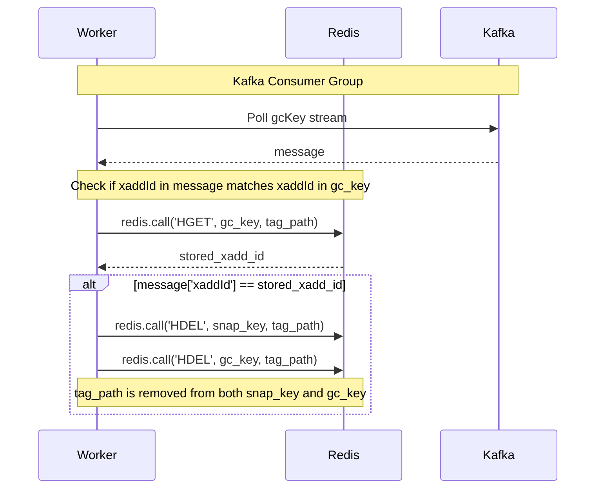

```mermaid
sequenceDiagram
    participant W as Worker
    participant R as Redis
    participant K as Kafka

    Note over W, K: Kafka Consumer Group

    W->>K: Poll gcKey stream
    K-->>W: message

    Note over W, R: Check if xaddId in message matches xaddId in gc_key

    W->>R: redis.call('HGET', gc_key, tag_path)
    R-->>W: stored_xadd_id

    alt message['xaddId'] == stored_xadd_id
        W->>R: redis.call('HDEL', snap_key, tag_path)
        W->>R: redis.call('HDEL', gc_key, tag_path)

        Note over W, R: tag_path is removed from both snap_key and gc_key
    end
```
