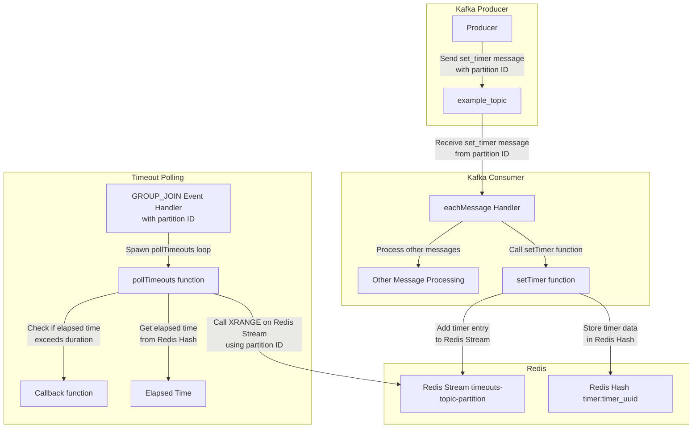

```mermaid
graph TB
    subgraph Kafka Producer
        P[Producer] -->|Send set_timer message<br>with partition ID| T[example_topic]
    end

    subgraph Kafka Consumer
        T -->|Receive set_timer message<br>from partition ID| H[eachMessage Handler]
        H -->|Call setTimer function| ST[setTimer function]
        H -->|Process other messages| OM[Other Message Processing]
    end

subgraph Redis
ST -->|Store timer data<br>in Redis Hash| RH[Redis Hash timer:timer_uuid]
ST -->|Add timer entry<br>to Redis Stream| RS[Redis Stream timeouts-topic-partition]
end

subgraph Timeout Polling
GJ[GROUP_JOIN Event Handler<br>with partition ID] -->|Spawn pollTimeouts loop| PT[pollTimeouts function]
PT -->|Call XRANGE on Redis Stream<br>using partition ID| RS
PT -->|Get elapsed time<br>from Redis Hash| E[Elapsed Time]
PT -->|Check if elapsed time<br>exceeds duration| CB[Callback function]
end
```
