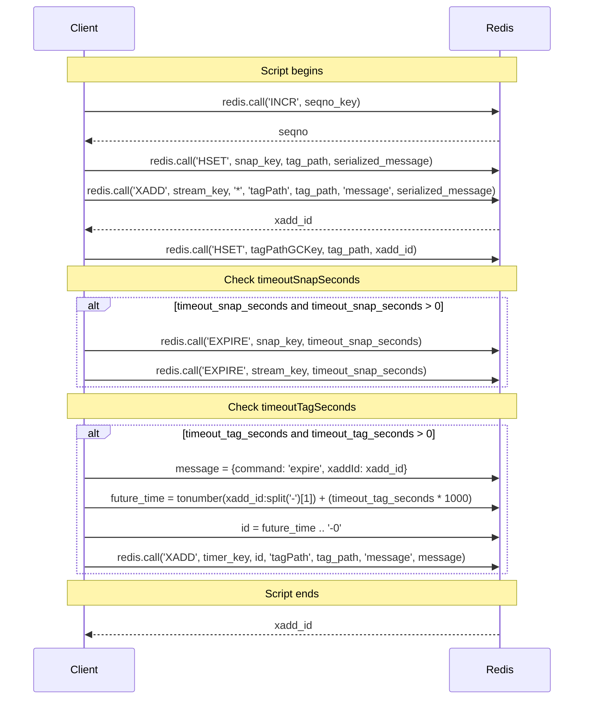
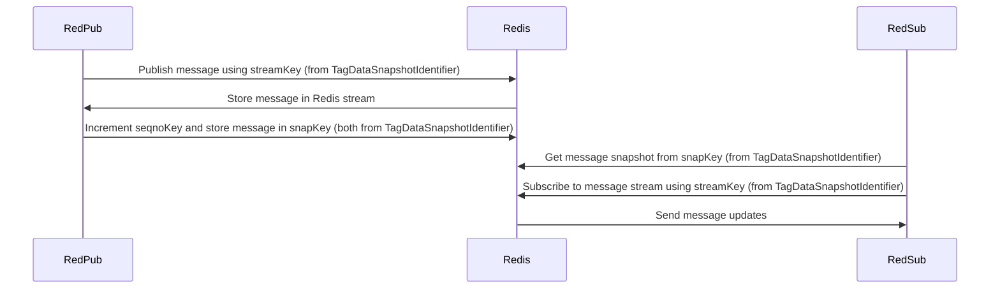

```mermaid
sequenceDiagram
    participant C as Client
    participant R as Redis

    Note over C, R: Script begins

    C->>R: redis.call('INCR', seqno_key)
    R-->>C: seqno

    C->>R: redis.call('HSET', snap_key, tag_path, serialized_message)

    C->>R: redis.call('XADD', stream_key, '*', 'tagPath', tag_path, 'message', serialized_message)
    R-->>C: xadd_id

    C->>R: redis.call('HSET', tagPathGCKey, tag_path, xadd_id)

    Note over C, R: Check timeoutSnapSeconds
    alt timeout_snap_seconds and timeout_snap_seconds > 0
        C->>R: redis.call('EXPIRE', snap_key, timeout_snap_seconds)
        C->>R: redis.call('EXPIRE', stream_key, timeout_snap_seconds)
    end

    Note over C, R: Check timeoutTagSeconds
    alt timeout_tag_seconds and timeout_tag_seconds > 0
        C->>R: message = {command: 'expire', xaddId: xadd_id}
        C->>R: future_time = tonumber(xadd_id:split('-')[1]) + (timeout_tag_seconds * 1000)
        C->>R: id = future_time .. '-0'
        C->>R: redis.call('XADD', timer_key, id, 'tagPath', tag_path, 'message', message)
    end

    Note over C, R: Script ends
    R-->>C: xadd_id
```

```mermaid
sequenceDiagram
    participant A as RedPub
    participant R as Redis
    participant B as RedSub

    A->>R: Publish message using streamKey (from TagDataSnapshotIdentifier)
    R->>A: Store message in Redis stream
    A->>R: Increment seqnoKey and store message in snapKey (both from TagDataSnapshotIdentifier)
    B->>R: Get message snapshot from snapKey (from TagDataSnapshotIdentifier)
    B->>R: Subscribe to message stream using streamKey (from TagDataSnapshotIdentifier)
    R->>B: Send message updates
```
