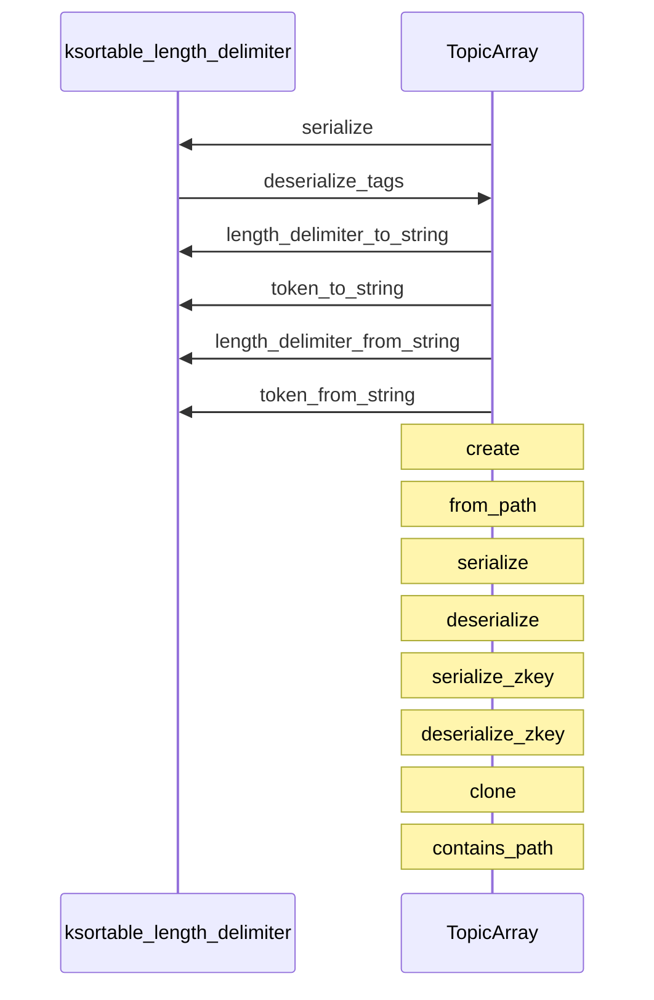

```mermaid
sequenceDiagram
participant k as ksortable_length_delimiter
participant t as TopicArray

t->>k: serialize
k->>t: deserialize_tags
t->>k: length_delimiter_to_string
t->>k: token_to_string
t->>k: length_delimiter_from_string
t->>k: token_from_string

Note over t: create
Note over t: from_path
Note over t: serialize
Note over t: deserialize
Note over t: serialize_zkey
Note over t: deserialize_zkey
Note over t: clone
Note over t: contains_path
```