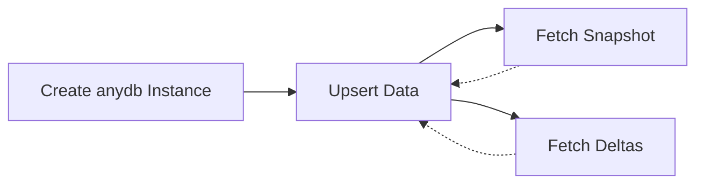
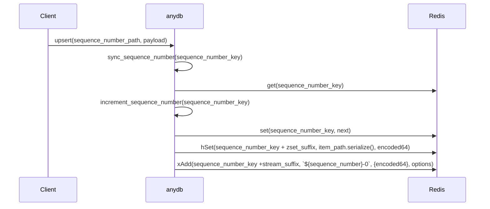
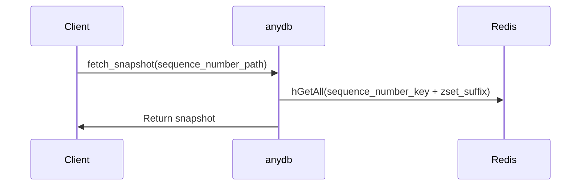
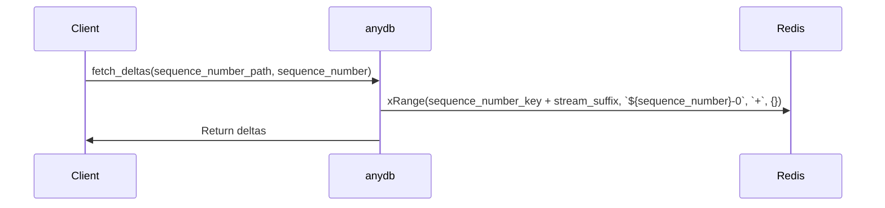

Mermaid.js is a diagramming library that supports generating flowcharts, sequence diagrams, Gantt charts, class diagrams, state diagrams, and pie charts. Here are some Mermaid.js diagrams for the `anydb` class that cover different aspects of its functionality:

1. Flowchart showing the main methods of the `anydb` class:

2. Sequence diagram for the `upsert` method:

3. Sequence diagram for the `fetch_snapshot` method:

4. Sequence diagram for the `fetch_deltas` method:

These diagrams provide a visual representation of the main components and interactions within the `anydb` class. You can use these diagrams to better understand the class's structure and behavior.
