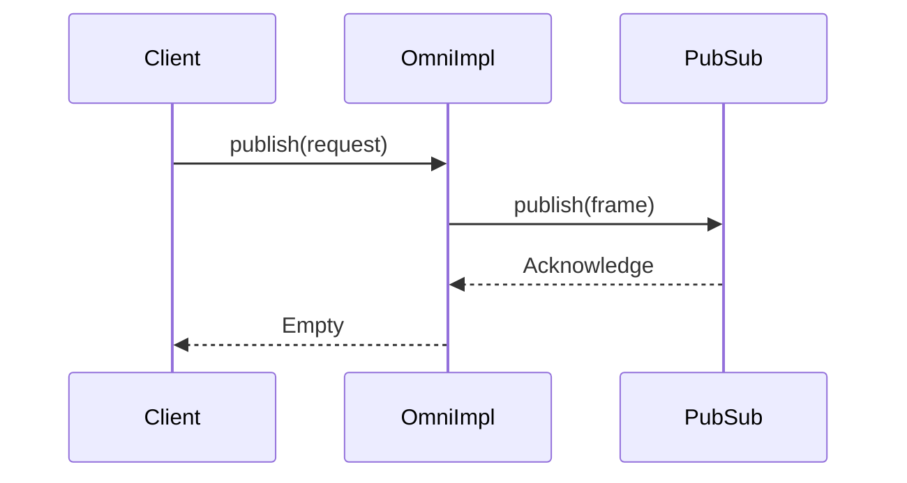
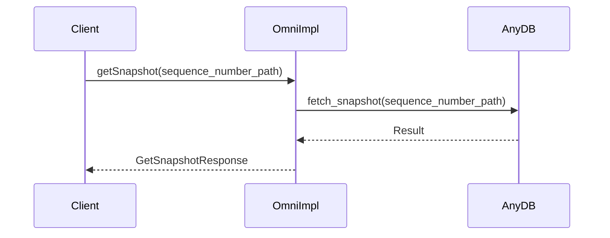
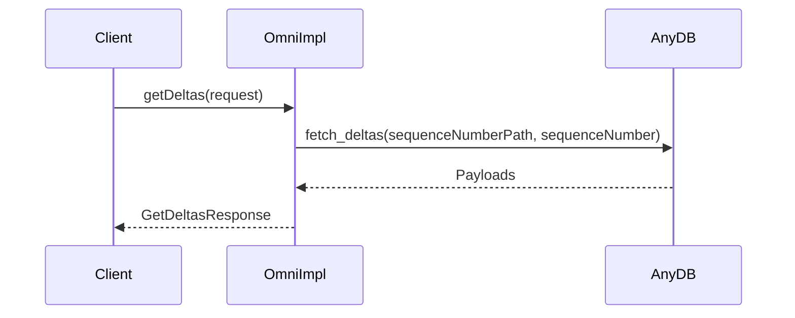
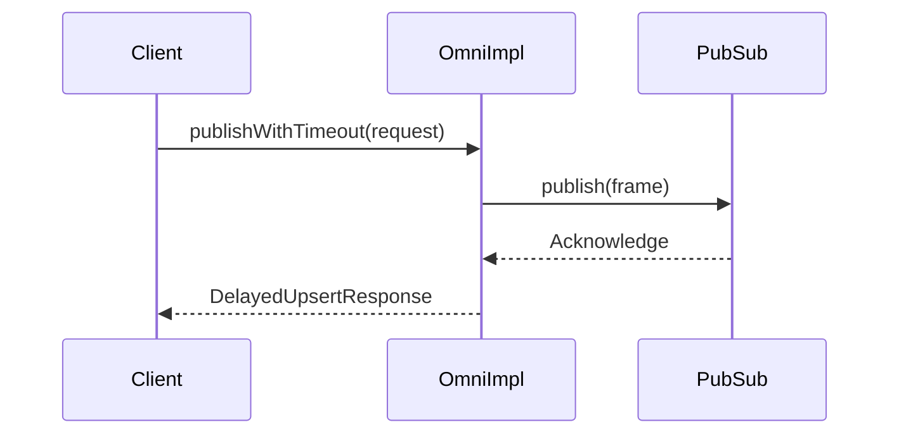
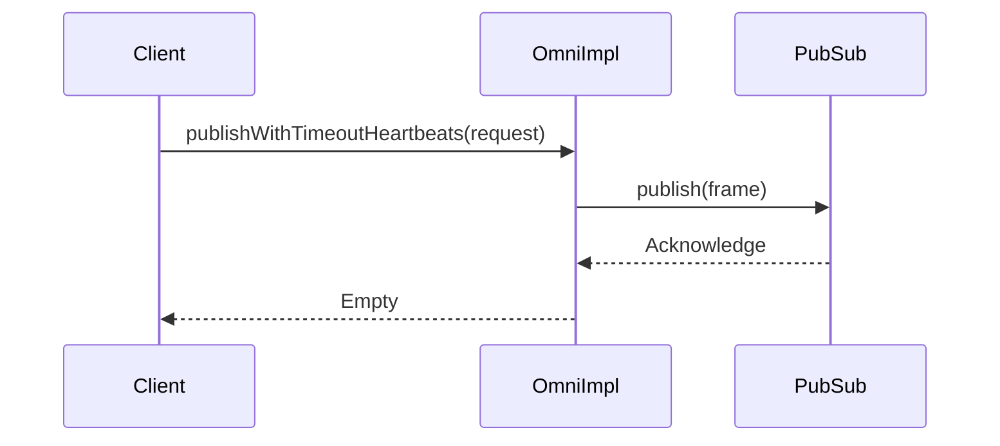
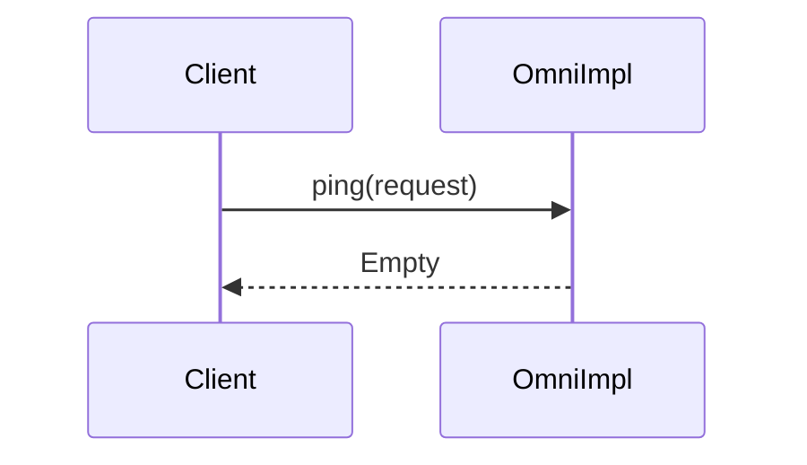

Here are the sequence diagrams for each method in the `OmniImpl` class:

1. publish

2. getSnapshot

3. getDeltas

4. publishWithTimeout

5. publishWithTimeoutHeartbeats

6. ping

These diagrams show the interactions between the client, `OmniImpl`, `AnyDB`, and `PubSub` for each of the methods in the `OmniImpl` class.
