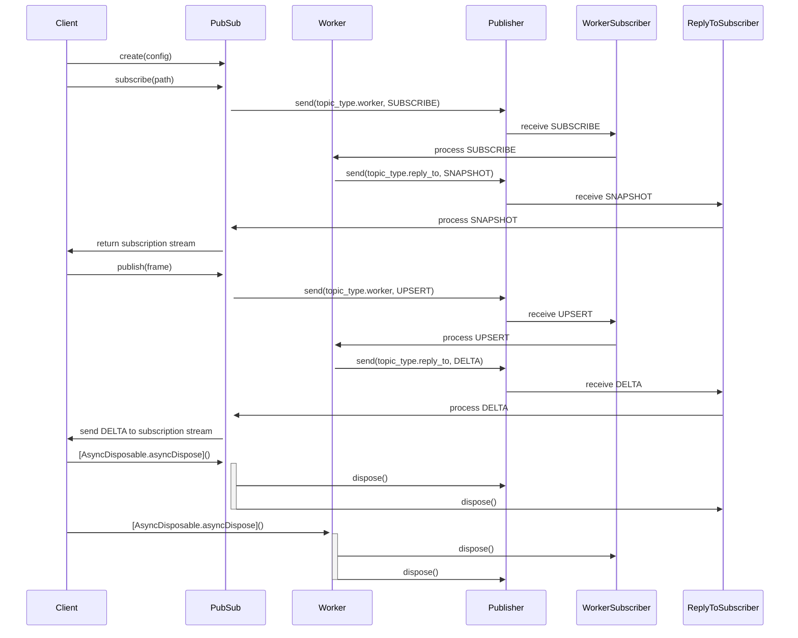

```mermaid
sequenceDiagram
participant Client as Client
participant PubSub as PubSub
participant Worker as Worker
participant Publisher as Publisher
participant WorkerSubscriber as WorkerSubscriber
participant ReplyToSubscriber as ReplyToSubscriber

Client->>PubSub: create(config)
activate PubSub

Client->>PubSub: subscribe(path)
activate PubSub
PubSub->>Publisher: send(topic_type.worker, SUBSCRIBE)
Publisher->>WorkerSubscriber: receive SUBSCRIBE
WorkerSubscriber->>Worker: process SUBSCRIBE
activate Worker
Worker->>Publisher: send(topic_type.reply_to, SNAPSHOT)
Publisher->>ReplyToSubscriber: receive SNAPSHOT
ReplyToSubscriber->>PubSub: process SNAPSHOT
PubSub->>Client: return subscription stream

Client->>PubSub: publish(frame)
activate PubSub
PubSub->>Publisher: send(topic_type.worker, UPSERT)
Publisher->>WorkerSubscriber: receive UPSERT
WorkerSubscriber->>Worker: process UPSERT
Worker->>Publisher: send(topic_type.reply_to, DELTA)
Publisher->>ReplyToSubscriber: receive DELTA
ReplyToSubscriber->>PubSub: process DELTA
PubSub->>Client: send DELTA to subscription stream

Client->>PubSub: [AsyncDisposable.asyncDispose]()
activate PubSub
PubSub->>Publisher: dispose()
PubSub->>ReplyToSubscriber: dispose()
deactivate PubSub

Client->>Worker: [AsyncDisposable.asyncDispose]()
activate Worker
Worker->>WorkerSubscriber: dispose()
Worker->>Publisher: dispose()
deactivate Worker
```