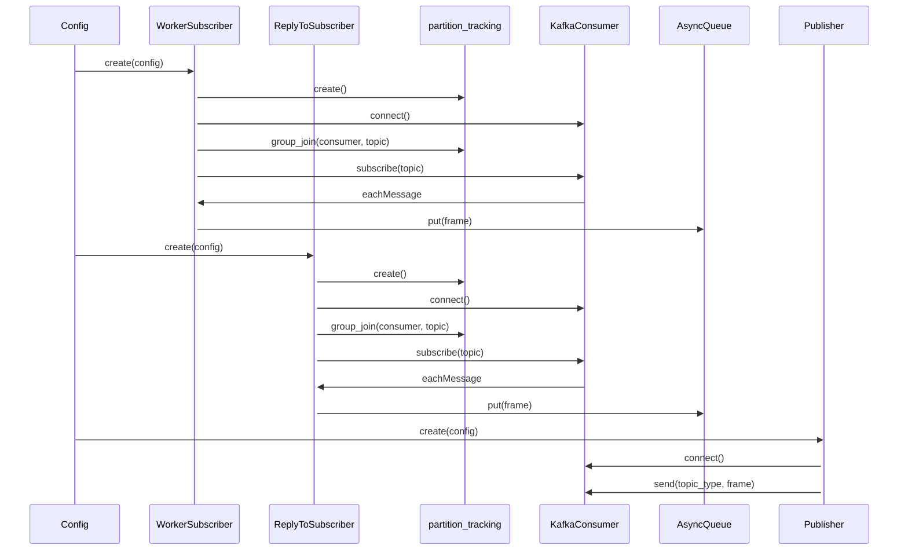

```mermaid
sequenceDiagram
    participant Config as Config
    participant WorkerSubscriber as WorkerSubscriber
    participant ReplyToSubscriber as ReplyToSubscriber
    participant partition_tracking as partition_tracking
    participant KafkaConsumer as KafkaConsumer
    participant AsyncQueue as AsyncQueue
    participant Publisher as Publisher

    Config->>WorkerSubscriber: create(config)
    activate WorkerSubscriber
    WorkerSubscriber->>partition_tracking: create()
    WorkerSubscriber->>KafkaConsumer: connect()
    WorkerSubscriber->>partition_tracking: group_join(consumer, topic)
    WorkerSubscriber->>KafkaConsumer: subscribe(topic)
    KafkaConsumer->>WorkerSubscriber: eachMessage
    WorkerSubscriber->>AsyncQueue: put(frame)
    
    Config->>ReplyToSubscriber: create(config)
    activate ReplyToSubscriber
    ReplyToSubscriber->>partition_tracking: create()
    ReplyToSubscriber->>KafkaConsumer: connect()
    ReplyToSubscriber->>partition_tracking: group_join(consumer, topic)
    ReplyToSubscriber->>KafkaConsumer: subscribe(topic)
    KafkaConsumer->>ReplyToSubscriber: eachMessage
    ReplyToSubscriber->>AsyncQueue: put(frame)
    Config->>Publisher: create(config)
    activate Publisher
    Publisher->>KafkaConsumer: connect()
    Publisher->>KafkaConsumer: send(topic_type, frame)
```
