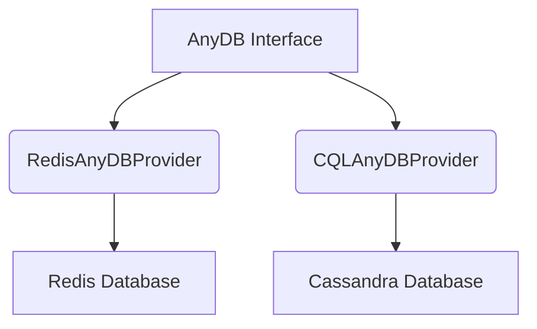
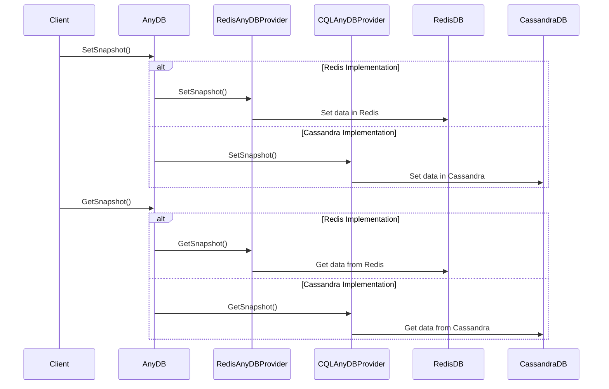

```mermaid
graph TD
    A[AnyDB Interface] --> B(RedisAnyDBProvider)
    A --> C(CQLAnyDBProvider)
    B --> D[Redis Database]
    C --> E[Cassandra Database]
```

```mermaid
sequenceDiagram
    participant Client
    participant AnyDB
    participant RedisAnyDBProvider
    participant CQLAnyDBProvider
    participant RedisDB
    participant CassandraDB

    Client->>AnyDB: SetSnapshot()
    alt Redis Implementation
        AnyDB->>RedisAnyDBProvider: SetSnapshot()
        RedisAnyDBProvider->>RedisDB: Set data in Redis
    else Cassandra Implementation
        AnyDB->>CQLAnyDBProvider: SetSnapshot()
        CQLAnyDBProvider->>CassandraDB: Set data in Cassandra
    end

    Client->>AnyDB: GetSnapshot()
    alt Redis Implementation
        AnyDB->>RedisAnyDBProvider: GetSnapshot()
        RedisAnyDBProvider->>RedisDB: Get data from Redis
    else Cassandra Implementation
        AnyDB->>CQLAnyDBProvider: GetSnapshot()
        CQLAnyDBProvider->>CassandraDB: Get data from Cassandra
    end
```
