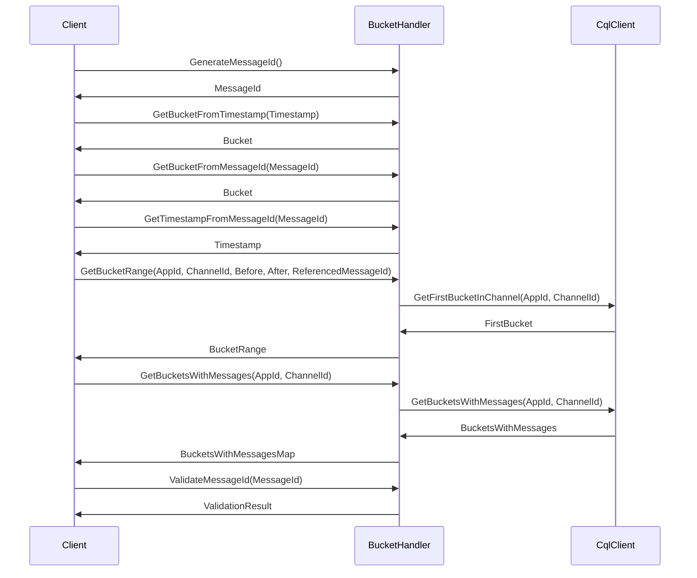
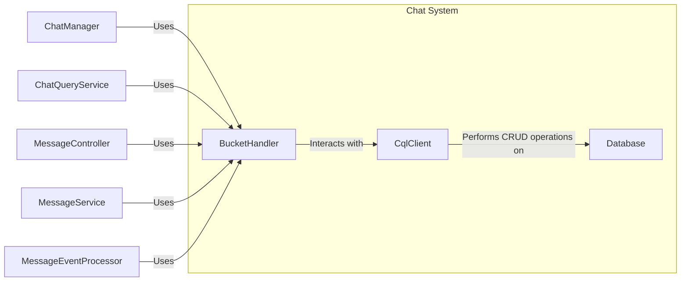

```mermaid
sequenceDiagram
    participant Client
    participant BucketHandler
    participant CqlClient
    Client->>BucketHandler: GenerateMessageId()
    BucketHandler->>Client: MessageId
    Client->>BucketHandler: GetBucketFromTimestamp(Timestamp)
    BucketHandler->>Client: Bucket
    Client->>BucketHandler: GetBucketFromMessageId(MessageId)
    BucketHandler->>Client: Bucket
    Client->>BucketHandler: GetTimestampFromMessageId(MessageId)
    BucketHandler->>Client: Timestamp
    Client->>BucketHandler: GetBucketRange(AppId, ChannelId, Before, After, ReferencedMessageId)
    BucketHandler->>CqlClient: GetFirstBucketInChannel(AppId, ChannelId)
    CqlClient->>BucketHandler: FirstBucket
    BucketHandler->>Client: BucketRange
    Client->>BucketHandler: GetBucketsWithMessages(AppId, ChannelId)
    BucketHandler->>CqlClient: GetBucketsWithMessages(AppId, ChannelId)
    CqlClient->>BucketHandler: BucketsWithMessages
    BucketHandler->>Client: BucketsWithMessagesMap
    Client->>BucketHandler: ValidateMessageId(MessageId)
    BucketHandler->>Client: ValidationResult
```

```mermaid
graph LR
    ChatManager --> |Uses| BucketHandler
    ChatQueryService --> |Uses| BucketHandler
    MessageController --> |Uses| BucketHandler
    MessageService --> |Uses| BucketHandler
    MessageEventProcessor --> |Uses| BucketHandler

    subgraph Chat System
        BucketHandler --> |Interacts with| CqlClient
        CqlClient --> |Performs CRUD operations on| Database[Database]
    end
```
