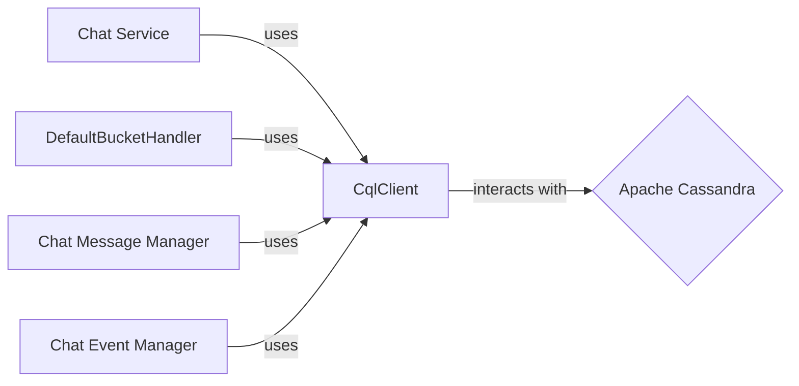
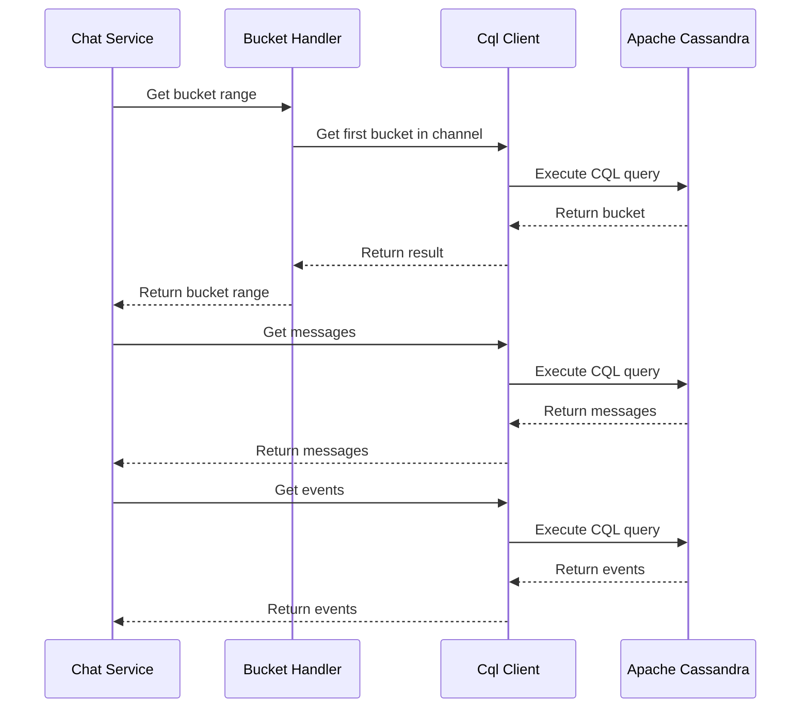

```mermaid
graph LR
  A1[Chat Service] -- uses --> B1[CqlClient]
  A2[DefaultBucketHandler] -- uses --> B1[CqlClient]
  A3[Chat Message Manager] -- uses --> B1[CqlClient]
  A4[Chat Event Manager] -- uses --> B1[CqlClient]
  B1[CqlClient] -- interacts with --> C1{Apache Cassandra}
```

```mermaid
sequenceDiagram
  participant ChatService as Chat Service
  participant DefaultBucketHandler as Bucket Handler
  participant CqlClient as Cql Client
  participant ApacheCassandra as Apache Cassandra

  ChatService->>DefaultBucketHandler: Get bucket range
  DefaultBucketHandler->>CqlClient: Get first bucket in channel
  CqlClient->>ApacheCassandra: Execute CQL query
  ApacheCassandra-->>CqlClient: Return bucket
  CqlClient-->>DefaultBucketHandler: Return result
  DefaultBucketHandler-->>ChatService: Return bucket range

  ChatService->>CqlClient: Get messages
  CqlClient->>ApacheCassandra: Execute CQL query
  ApacheCassandra-->>CqlClient: Return messages
  CqlClient-->>ChatService: Return messages

  ChatService->>CqlClient: Get events
  CqlClient->>ApacheCassandra: Execute CQL query
  ApacheCassandra-->>CqlClient: Return events
  CqlClient-->>ChatService: Return events
```