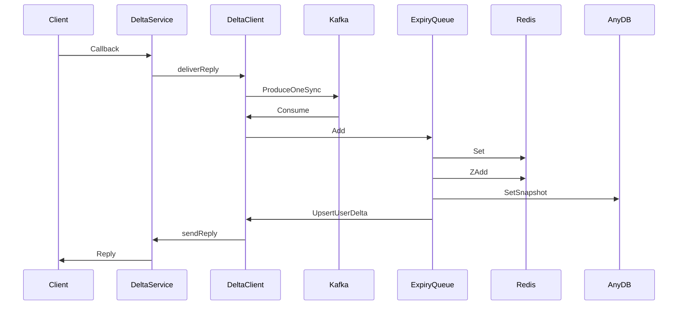
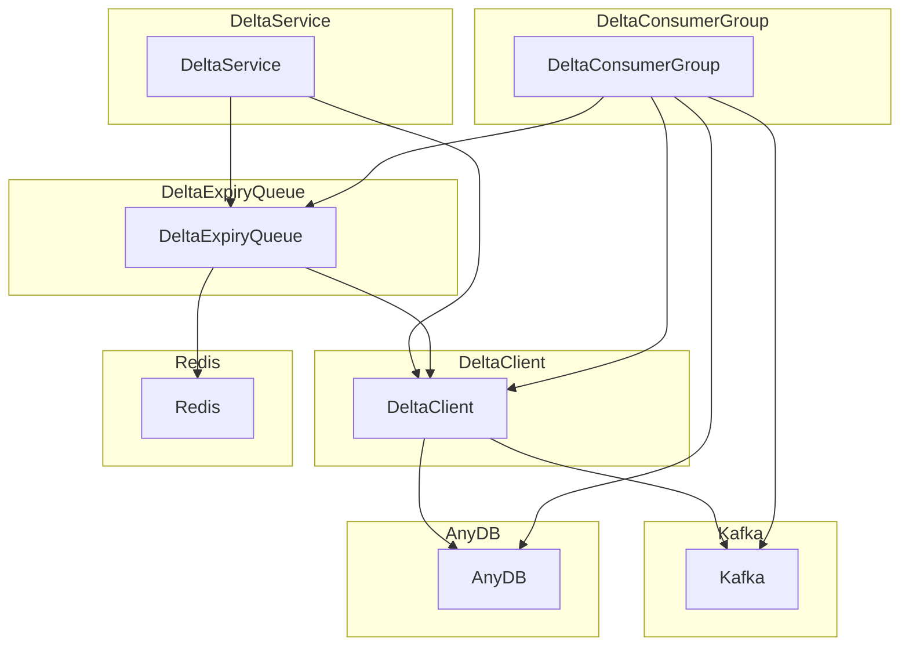

```mermaid
sequenceDiagram
  participant Client as Client
  participant DeltaService as DeltaService
  participant DeltaClient as DeltaClient
  participant Kafka as Kafka
  participant ExpiryQueue as ExpiryQueue
  participant Redis as Redis
  participant AnyDB as AnyDB

  Client->>DeltaService: Callback
  DeltaService->>DeltaClient: deliverReply
  DeltaClient->>Kafka: ProduceOneSync
  Kafka->>DeltaClient: Consume
  DeltaClient->>ExpiryQueue: Add
  ExpiryQueue->>Redis: Set
  ExpiryQueue->>Redis: ZAdd
  ExpiryQueue->>AnyDB: SetSnapshot
  ExpiryQueue->>DeltaClient: UpsertUserDelta
  DeltaClient->>DeltaService: sendReply
  DeltaService->>Client: Reply
```

```mermaid
graph TB
    subgraph DeltaService
        DS[DeltaService]
    end
    subgraph DeltaClient
        DC[DeltaClient]
    end
    subgraph DeltaExpiryQueue
        DEQ[DeltaExpiryQueue]
    end
    subgraph DeltaConsumerGroup
        DCG[DeltaConsumerGroup]
    end
    subgraph Kafka
        K[Kafka]
    end
    subgraph AnyDB
        A[AnyDB]
    end
    subgraph Redis
        R[Redis]
    end

    DS --> DC
    DS --> DEQ
    DC --> K
    DC --> A
    DEQ --> R
    DEQ --> DC
    DCG --> K
    DCG --> A
    DCG --> DC
    DCG --> DEQ
```
