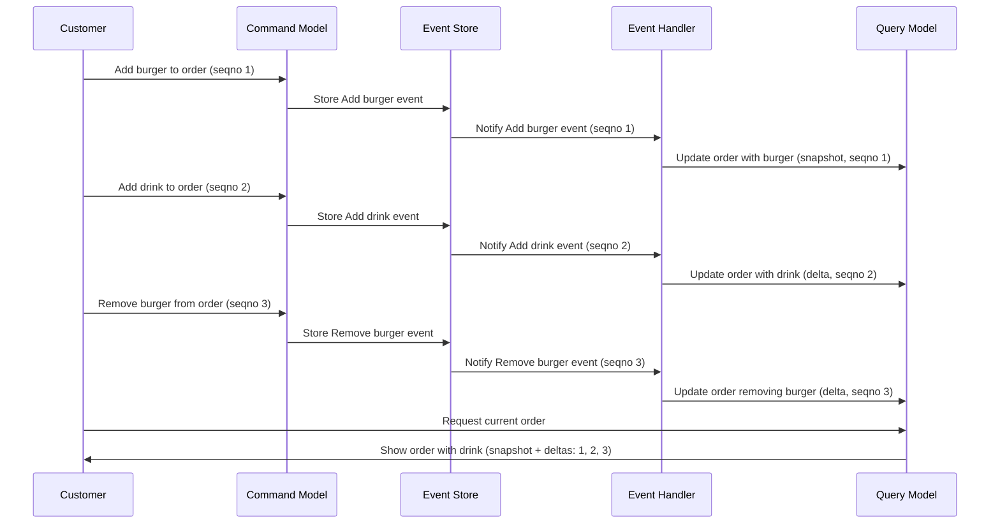

Below is the MermaidJS code for a diagram illustrating an example of CQRS and event sourcing in a drive-thru ordering system. It shows the order with items being added and removed while highlighting snapshots and deltas with sequence numbers (seqnos).

