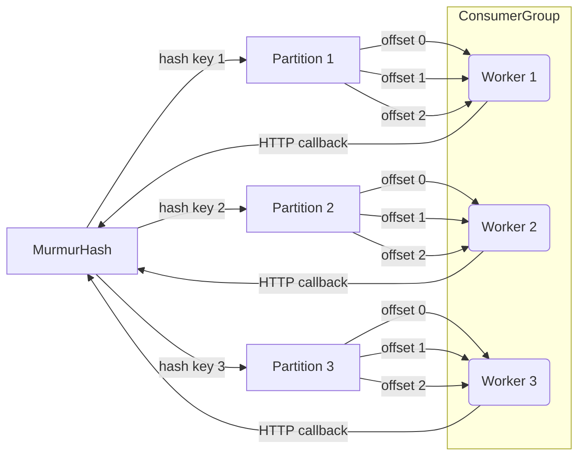

```mermaid
graph LR
    MH[MurmurHash] --> |hash key 1| P1[Partition 1]
    MH --> |hash key 2| P2[Partition 2]
    MH --> |hash key 3| P3[Partition 3]

    P1 --> |offset 0| W1(Worker 1)
    P1 --> |offset 1| W1
    P1 --> |offset 2| W1

    P2 --> |offset 0| W2(Worker 2)
    P2 --> |offset 1| W2
    P2 --> |offset 2| W2

    P3 --> |offset 0| W3(Worker 3)
    P3 --> |offset 1| W3
    P3 --> |offset 2| W3

    W1 -->|HTTP callback| MH
    W2 -->|HTTP callback| MH
    W3 -->|HTTP callback| MH

    subgraph ConsumerGroup
        W1
        W2
        W3
    end
```