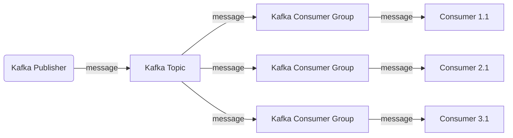
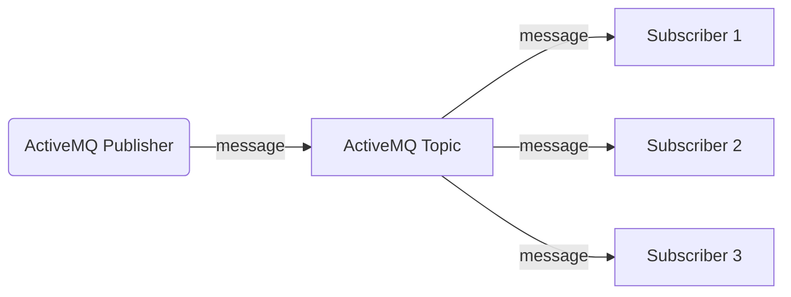

Kafka PubSub:

Regular PubSub (ActiveMQ):

In Kafka PubSub, the messages are published to topics, and each consumer group has at least one consumer. Each message is consumed by only one consumer within a consumer group. Multiple consumer groups can receive the published message, allowing parallel processing.

In the case of Regular PubSub (ActiveMQ), messages are published to a topic, and all subscribers receive the message.
