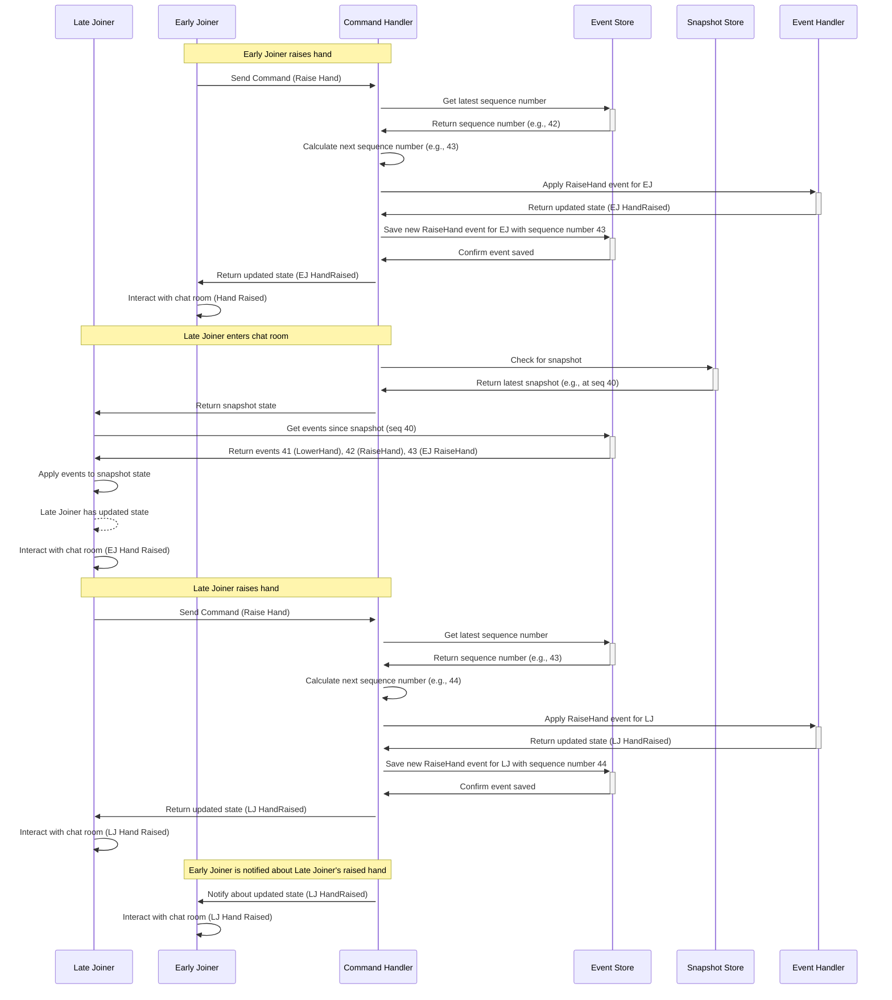

In this sequence diagram, there are two users: an early joiner and a late joiner. The early joiner raises their hand in the chat room first, and then the late joiner enters the chat room. The late joiner gets the current state of the chat room from the snapshot and event store, raises their hand, and interacts with the chat room. The early joiner receives a notification about the late joiner's raised hand and continues to interact with the chat room. The sequence emphasizes the sequence numbers used in event sourcing and CQRS systems to maintain the order of events and apply them correctly to the chat room state.
