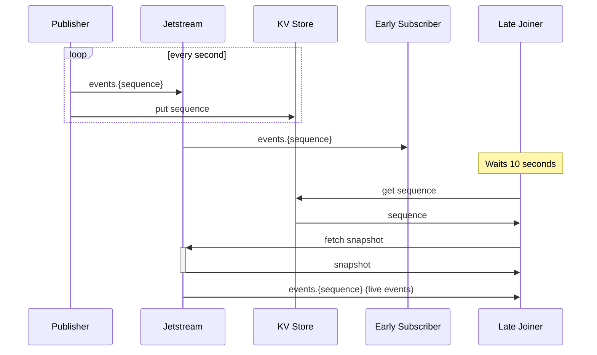

## Event Sourcing, Events, Snapshots, Late Joiners, and Sequence Number

Event sourcing is a software architecture pattern that involves representing the state of an application in terms of a sequence of events. These events are stored in an event store, and can be replayed to restore the application state at any time.

### Events
Events are the building blocks of event sourcing systems. An event is a representation of something that happened to the application, such as the creation of an entity, a change in an entity's state, or a business transaction. In event sourcing, events are immutable, meaning they cannot be changed once they are stored in the event store.

### Snapshots
Snapshots are optimized representations of an application's state at a certain point in time. They are created periodically by reading the state from a set of events up to a specific sequence number. Snapshots can be used to speed up the process of restoring an application's state, since an event store may contain millions of events that would take a long time to replay.

### Late Joiners
Late joiners are nodes or clients that join an event-sourced system after it has already been running for some time. These clients need to sync up their state with the current state of the system by replaying events from an appropriate snapshot or from the beginning of the event store.

### Sequence Number
Sequence numbers are used to keep track of the order of events in an event-sourced system. Each event has a sequence number, which is a unique identifier that increases for each subsequent event. Sequence numbers can be used to sync up the state of late joiners by identifying which events they need to replay.

## Syncing Up Late Joiners using the Snapshot and Events

To sync up a late joiner using the snapshot and events, the following steps can be taken:

1. Identify the most recent snapshot and its sequence number.
2. Start replaying events from the snapshot's sequence number.
3. As events are replayed, the late joiner's state is updated accordingly.
4. Once all events are replayed, the late joiner is now in sync with the current state of the system.


Now, here's an example involving publishers, subscribers, and a late joiner that utilizes Jetstream and KV storage:

```typescript
import { connect, StringCodec, JetStreamManager, KV } from "nats";

(async () => {
  const connection = await connect({ servers: "nats://localhost:4222" });

  const jsm = await JetStreamManager(connection);
  await jsm.streams.add({ name: "STREAM", subjects: ["events.*"] });

  const js = await connection.jetstream({ apiPrefix: "" });

  // Initialize the key-value store
  const kv = new KV(js, "snapshot");
  const key = "sequence";
  const sc = StringCodec();

  // Publisher
  setInterval(async () => {
    const sequence = parseInt(await kv.get(key), 10) || 0;
    await js.publish(`events.${sequence + 1}`, sc.encode("Hello, world!"));
    await kv.put(key, (sequence + 1).toString());
  }, 1000);

  // Early Subscriber
  const opts = js.opts();
  const sub = await js.subscribe("events.>", opts);
  (async () => {
    for await (const m of sub) {
      console.log(`Early subscriber: ${m.publish}`);
    }
  })().then();

  // Await some time before joining as late subscriber
  setTimeout(async () => {
    const currentSeq = parseInt(await kv.get(key), 10) || 0;
    const iteration = Math.max(0, currentSeq - 5);
    const snapshot = awithJS.streams().fetch("STREAM", { batchSize: 5, last: iteration });

    await snapshot.forEach((message) => {
      console.log(`Late joiner (snapshot): ${message.payload}`);
    });

    const lateSub = withJS.subscribe("events.>", { since: { seq: iteration + 1 } });

    for await (const m of lateSub) {
      console.log(`Late joiner (live events): ${m.publish}`);
    }
  }, 10000);
})();
```

Here we're using Jetstream and the key-value store from nats-js to store and retrieve our snapshots. The JetstreamManager sets up a STREAM and the Jetstream client is configured accordingly. The publisher is continuously emitting events, and the sequence is then stored in KV.

An early subscriber is started which receives all events, and after some time, a late joiner starts. The late joiner first retrieves the last few event snapshots from the KV, and then starts listening to live events.

Now, here's the corresponding MermaidJS diagram:



I hope this example better illustrates how sequence numbers can be used to sync up late joiners using the snapshot and events.
