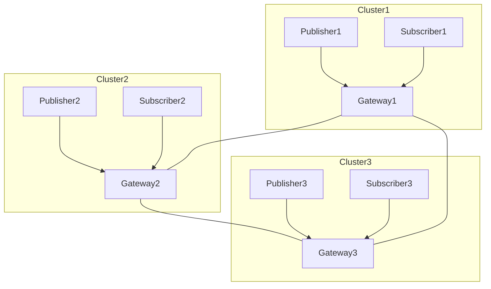

```mermaid
graph TD
    subgraph Cluster1
        gw1[Gateway1]
        P1[Publisher1] --> gw1
        S1[Subscriber1] --> gw1
    end

    subgraph Cluster2
        gw2[Gateway2]
        P2[Publisher2] --> gw2
        S2[Subscriber2] --> gw2
    end

    subgraph Cluster3
        gw3[Gateway3]
        P3[Publisher3] --> gw3
        S3[Subscriber3] --> gw3
    end

    gw1 --- gw2
    gw2 --- gw3
    gw3 --- gw1
```
