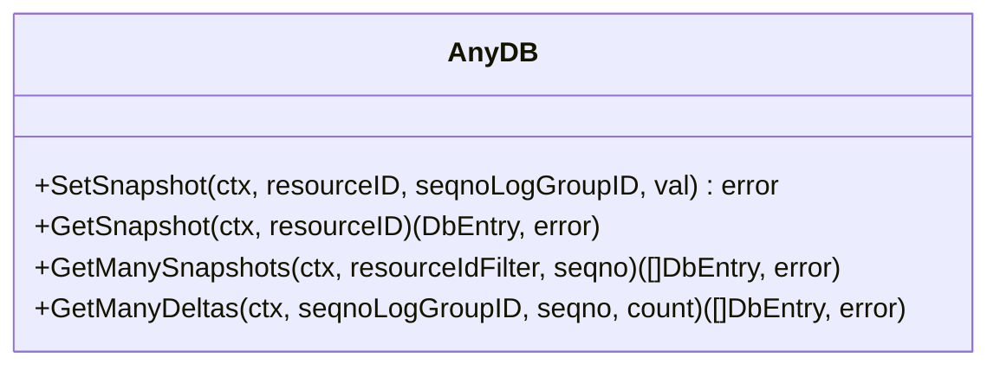
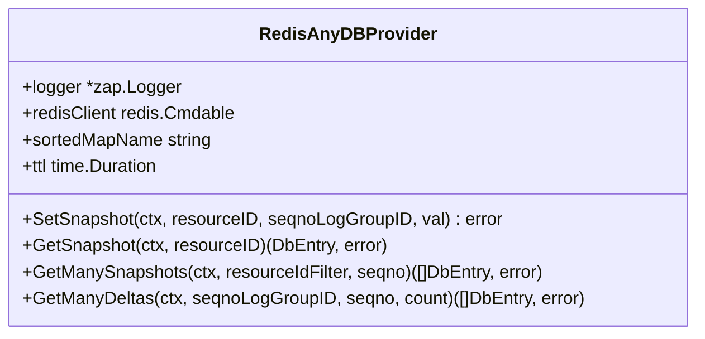
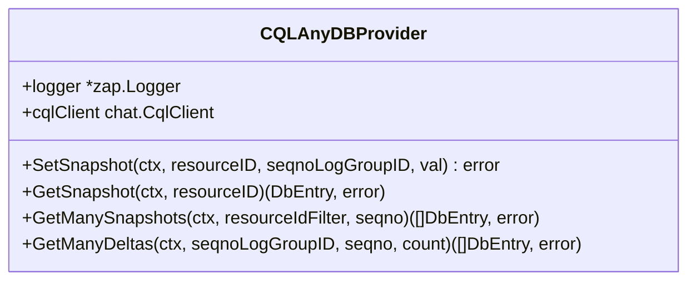
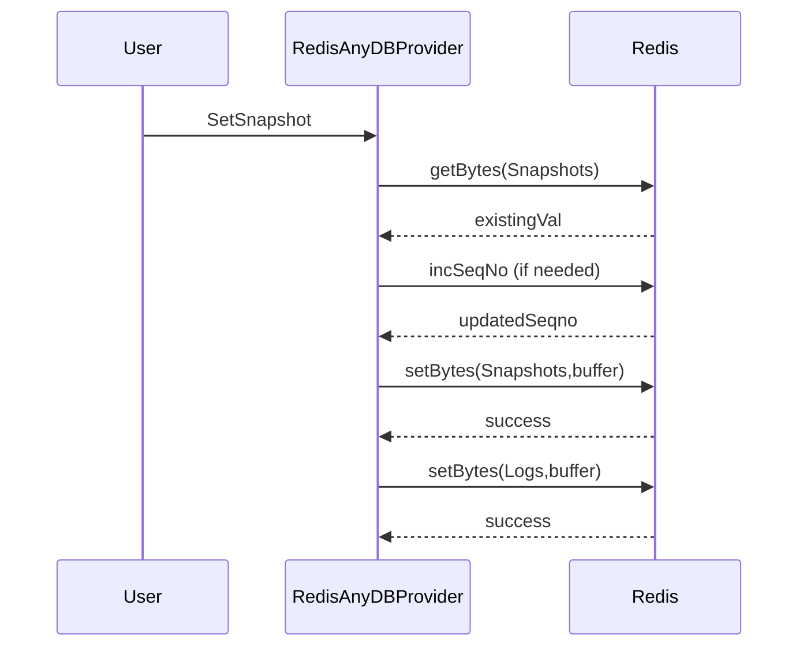
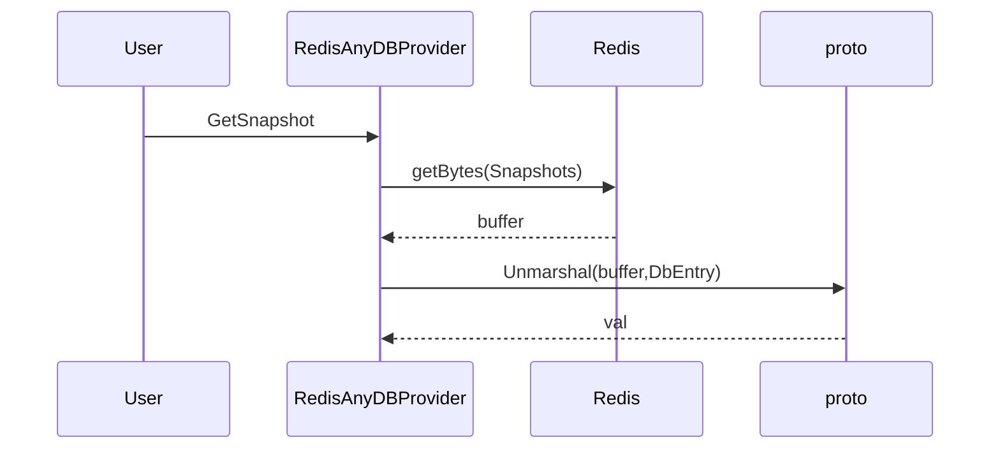
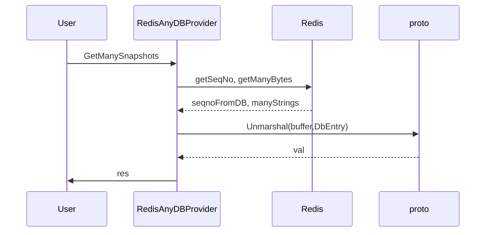
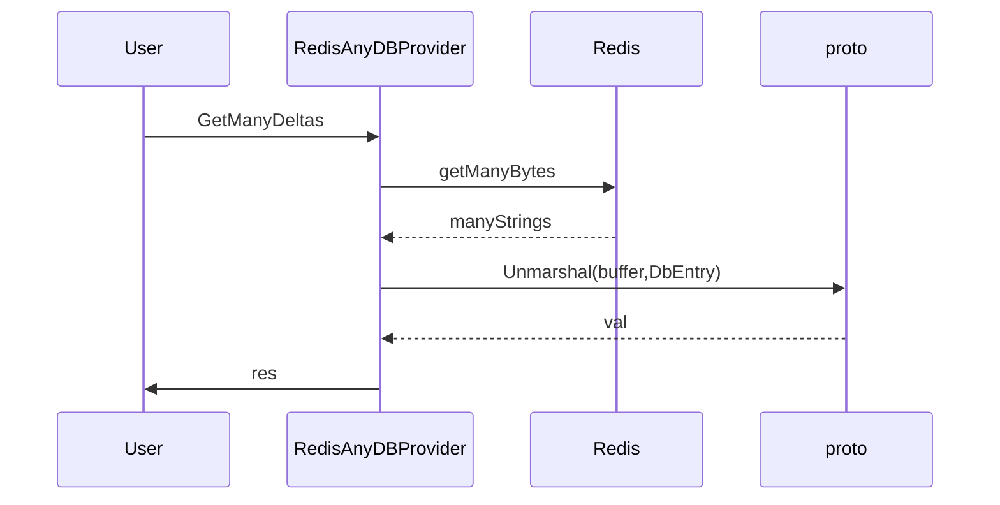
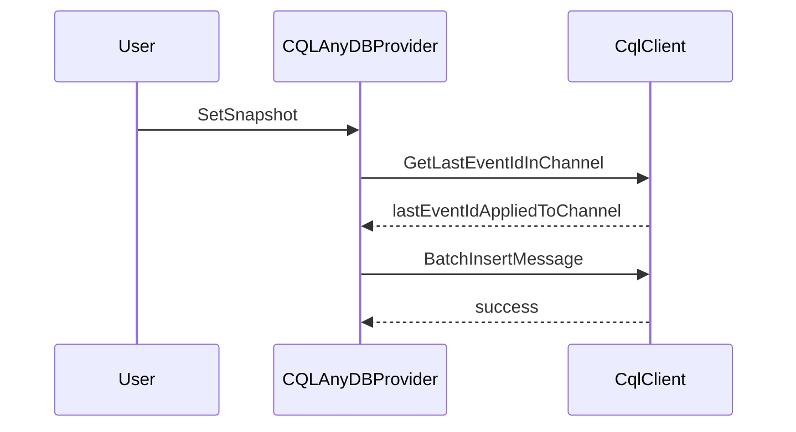
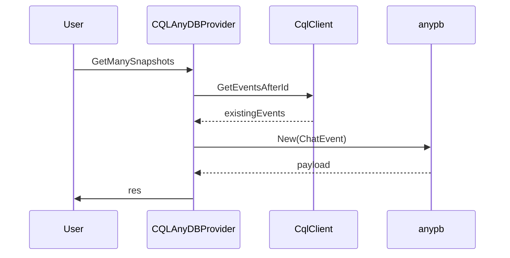

This code snippet consists of Go language code that provides an interface called `AnyDB` for working with a generic database system. There are two different implementations for this interface, one using the Redis database system, and another using the CQL data query language used in databases like ScyllaDB and Apache Cassandra.

The `AnyDB` interface has the following methods:

- `SetSnapshot` : Sets a snapshot of an entry in the database.
- `GetSnapshot` : Retrieves a snapshot of an entry from the database.
- `GetManySnapshots` : Retrieves multiple snapshots from the database, filtered by a given resource ID filter and sequence number.
- `GetManyDeltas` : Retrieves a sequence of changes (deltas) applied to the database entries, using a given sequence number log group ID, a starting sequence number, and a count parameter.

The `redis` package in the code provides an implementation of the `AnyDB` interface using a Redis database. The `cql` package provides an implementation of the `AnyDB` interface using CQL for databases like ScyllaDB and Apache Cassandra.

Overall, this code is designed to work with databases for data storage and retrieval, providing generic methods that can be used with different types of databases. Note that Redis implementation is complete, while the CQL implementation is not fully implemented (some methods return "not implemented yet").

The code provided contains three packages related to database handling. The three packages are `anydb`, `redis`, and `cql`. Let's explore each of them in detail.

1. anydb: This package contains an interface `AnyDB`, which defines 4 methods to interact with the database - `SetSnapshot`, `GetSnapshot`, `GetManySnapshots`, and `GetManyDeltas`. The purpose of these methods is to set, get, and retrieve multiple snapshots and deltas from the database.

2. redis: This package implements the `AnyDB` interface with Redis as the data storage. It uses `go-redis/v9` library to interact with Redis database. The package consists of a struct `RedisAnyDBProvider` that has methods corresponding to the methods defined in the `AnyDB` interface.

3. cql: The `cql` package also implements the `AnyDB` interface, but with Apache Cassandra as the data storage. The package uses `google.golang.org/protobuf` library for protobuf message handling.

The package contains a struct `CQLAnyDBProvider`, which consists of methods corresponding to the methods defined in the `AnyDB` interface.

This modular design allows code to switch between different database implementations, making it easy to switch to a different data storage mechanism in the future.

Here's an overview of the `RedisAnyDBProvider` and `CQLAnyDBProvider` operations with mermaid.js sequence diagrams:

1. RedisAnyDBProvider.SetSnapshot

2. RedisAnyDBProvider.GetSnapshot

3. RedisAnyDBProvider.GetManySnapshots

4. RedisAnyDBProvider.GetManyDeltas

5. CQLAnyDBProvider.SetSnapshot

6. CQLAnyDBProvider.GetManySnapshots

Note that the `GetSnapshot` and `GetManyDeltas` operations for `CQLAnyDBProvider` are not implemented yet, so they are not included in the diagrams.
