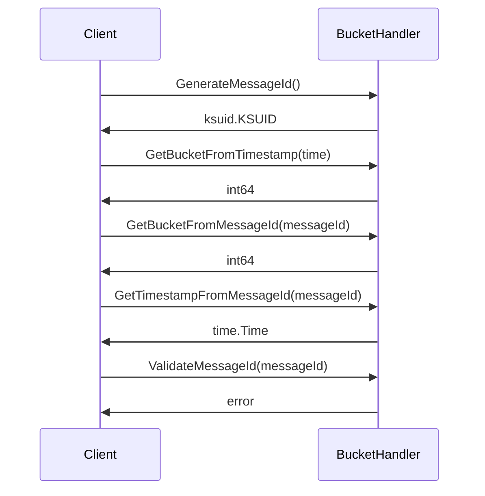
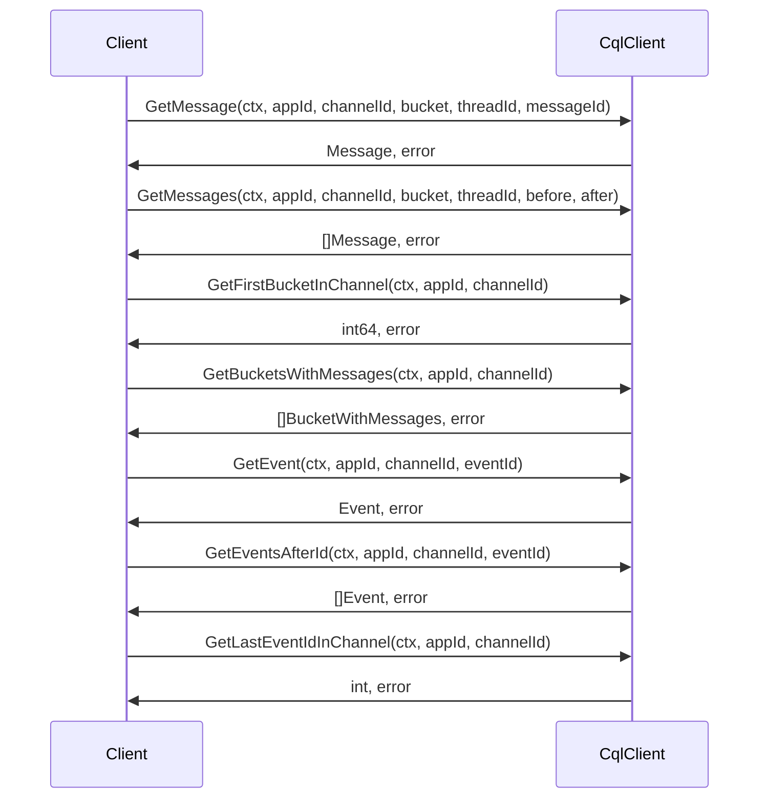

This package contains the implementation of the chat module, which is divided into two main parts: the BucketHandler and CqlClient. The BucketHandler is responsible for generating message IDs, getting message buckets, and validating message IDs. The CqlClient is responsible for interacting with the database to get messages, events, and buckets with messages.

Package layout:

```
chat
|- BucketHandler
   |- DefaultBucketHandler
|  |- BucketRange
|
|- CqlClient
   |- DefaultCqlClient
|  |- Message
|  |- FirstBucketInChannel
|  |- BucketWithMessages
|  |- Event
```

Let's look at the interactions between these components in more detail.

### Interaction 1: Generate, validate and get data from MessageID and Bucket



1. The client can request the BucketHandler to generate a new message ID, which is a KSUID (K-Sortable Unique Identifier).
2. The client can provide a `time.Time` object to get the corresponding bucket value.
3. The client can provide a `messageId` string to get the corresponding bucket value.
4. The client can provide a `messageId` string to get the timestamp associated with the ID.
5. The client can validate a given `messageId` to ensure it follows the proper format.

### Interaction 2: Requesting messages and events from CqlClient



1. The client can request a specific message from the CqlClient by providing the `appId`, `channelId`, `bucket`, `threadId`, and `messageId`.
2. The client can request a list of messages by providing the `appId`, `channelId`, `bucket`, `threadId`, and either a `before` messageId or an `after` messageId.
3. The client can request the first bucket value in a channel by providing the `appId` and `channelId`. This helps in getting the range for fetching messages efficiently.
4. The client can request a list of non-empty buckets in a channel by providing the `appId` and `channelId`. This helps in optimizing which buckets to search for messages.
5. The client can request an event by providing the `appId`, `channelId`, and `eventId`.
6. The client can request all events that occurred after a specific eventId by providing the `appId`, `channelId`, and `eventId`.
7. The client can request the last event ID in a channel by providing the `appId` and `channelId`.

These interactions allow a client to retrieve messages and events from the chat module, and the BucketHandler helps optimize the process by using buckets as an indexing mechanism for querying the relevant data.
