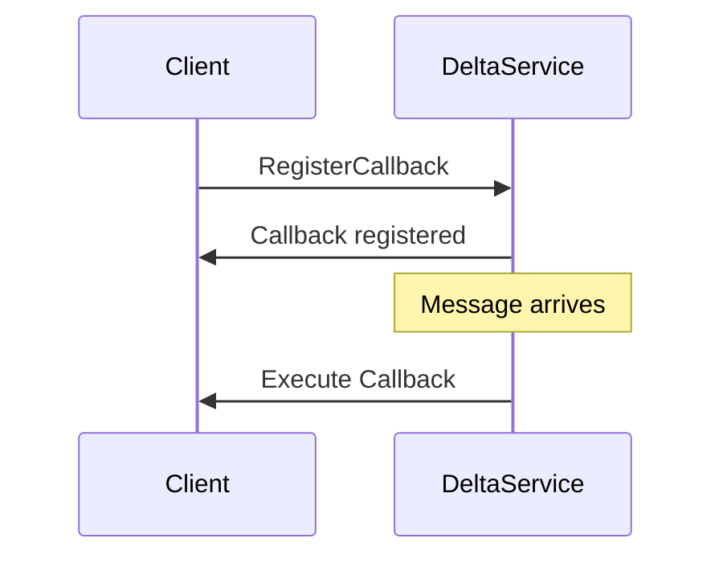
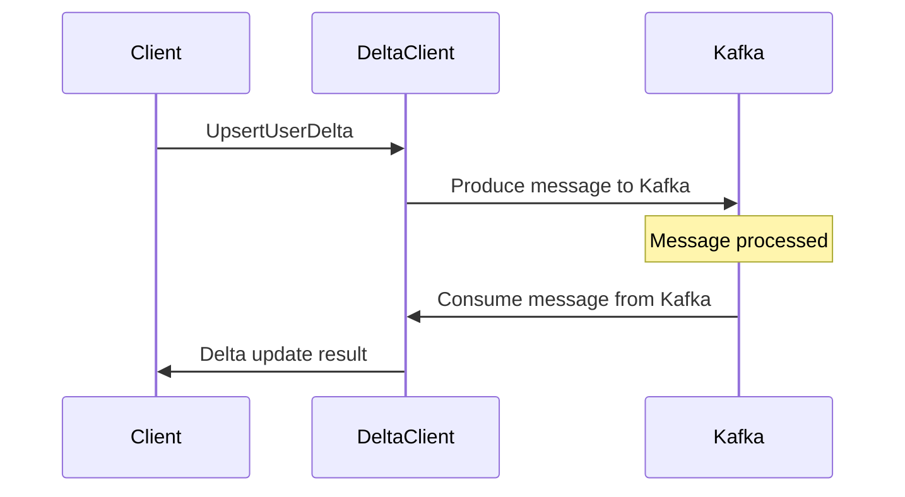
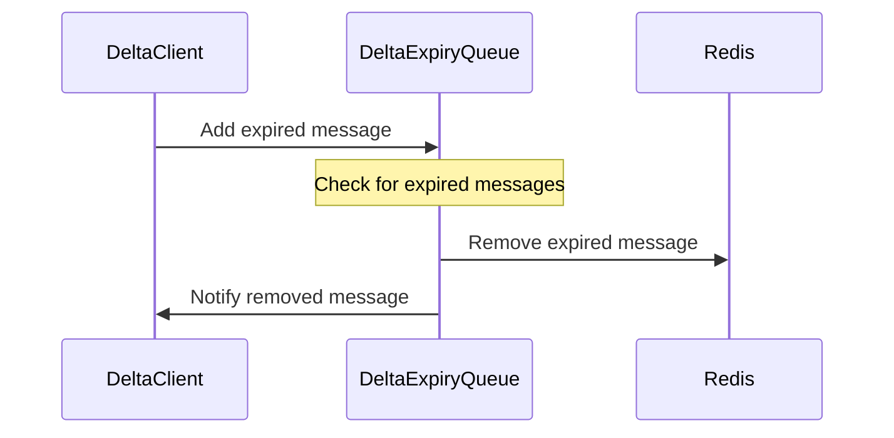
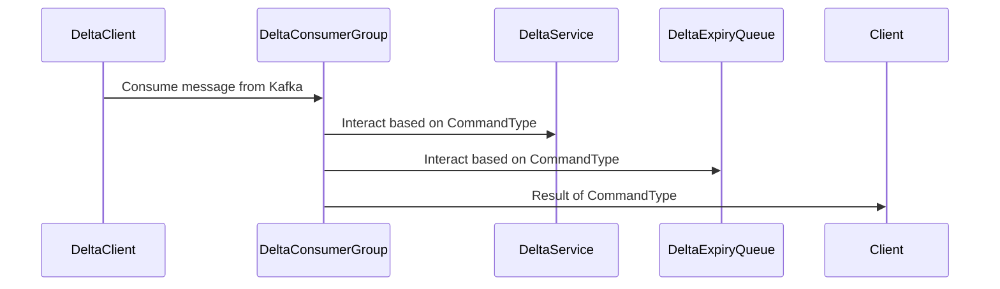

DeltaService is an API Service responsible for receiving and processing upsert and fetchAs a brief overview, the provided code appears to be written in Go, and it is responsible for handling operations and services related to deltas. There is a `DeltaService` struct that handles callbacks, a `DeltaClient` struct that implements various methods for upserting and fetching user deltas, a `DeltaExpiryQueue` struct for managing expiry of deltas, and a `DeltaConsumerGroup` for consuming deltas from Kafka queues.

There are some main functionalities included in this code:

1. The `DeltaService` provides a `Callback` method that processes messages passed from client instances, such as delivering replies to clients.
2. The `DeltaClient` struct is responsible for managing user deltas and provides methods to upsert deltas (`UpsertUserDelta`), fetch deltas (`FetchUserDeltas`), and handle delta responses from other services.
3. The `DeltaExpiryQueue` manages the expiration of deltas using a Redis-based queue. It provides methods to add deltas to the queue (`Add`), start the queue processing (`Start`), and handle expired deltas (`handleExpiredMsg`).
4. The `DeltaConsumerGroup` is responsible for consuming deltas from Kafka topics, processing them, and sending them to the `DeltaService` for further handling.

In this code, we have a system that handles delta updates for users, allowing them to fetch and upsert deltas or changes for their data. The system is built upon different components such as the DeltaService, DeltaClient, DeltaExpiryQueue, and DeltaConsumerGroup. Let's break down each component and see how it works with the help of MermaidJS diagrams.

1. **DeltaService**

DeltaService is responsible for managing callbacks that deliver replies to clients. It allows other services to register callbacks, which will be executed when new messages arrive.

2. **DeltaClient**

DeltaClient is responsible for communicating with Kafka, an event streaming platform. It can produce and consume messages that include various commands like UpsertUserDelta and FetchUserDeltas.

3. **DeltaExpiryQueue**

DeltaExpiryQueue manages the expired messages that need to be removed from the system. It keeps track of these messages in a Redis-based queue and regularly checks for expired messages to handle them accordingly.

4. **DeltaConsumerGroup**

DeltaConsumer isGroup responsible for consuming messages from Kafka and handling them according to the CommandType. It processes UpsertUserDelta, FetchUserDeltas, and Cancel commands, updates the data, and interacts with DeltaService and DeltaExpiryQueue.

