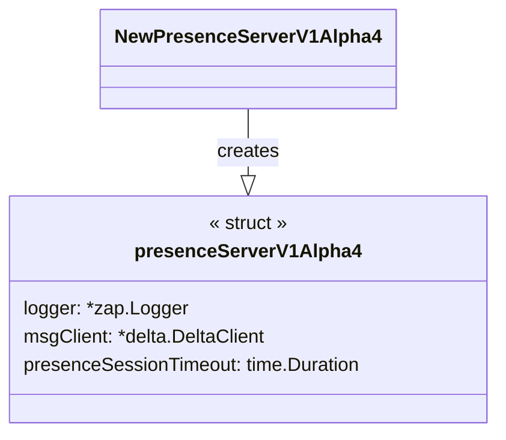
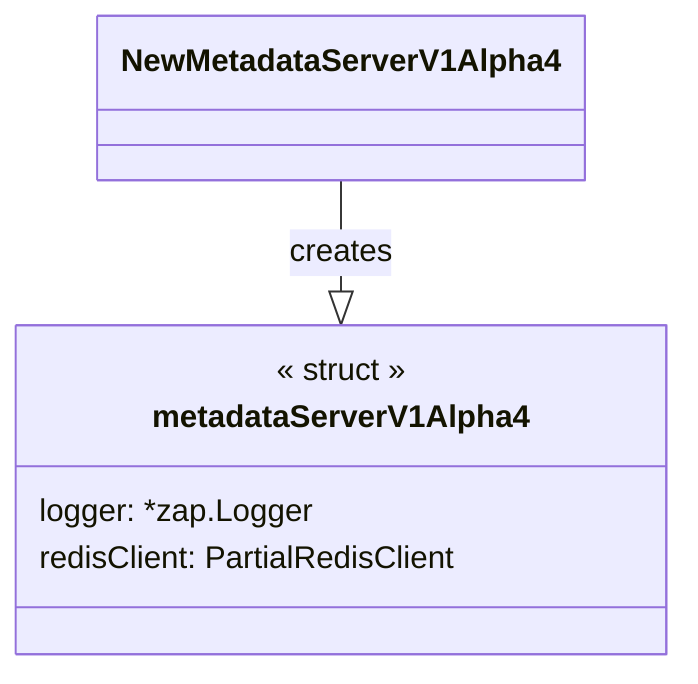
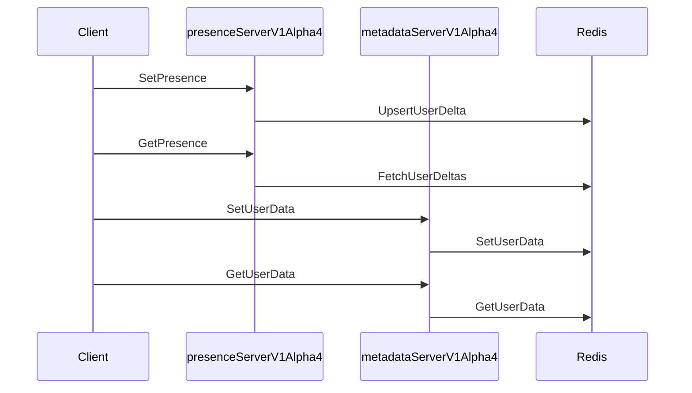

information, and functions to setThis code file contains multiple packages related to the implementation of Presence functionality in a Go server. These include:

1. `package presence`: This package defines a `presenceServerV1Alpha4` struct and the corresponding methods for handling SetPresence and GetPresence requests. It also includes a `PresenceConfig` struct and a constructor function `NewPresenceServerV1Alpha4` for creating instances of the `presenceServerV1Alpha4` struct.

2. `func authTokenToPresenceAddress`: This is a helper function which extracts a presence address from an auth token present in the context.

3. `func authTokenToMetadataAddress`: This is a helper function which extracts a metadata address from an auth token present in the context.

4. `package presence` (second instance): This package defines a `metadataServerV1Alpha4` struct and the corresponding methods for handling SetUserData and GetUserData requests. It also includes a constructor function `NewMetadataServerV1Alpha4` for creating instances of the `metadataServerV1Alpha4` struct.

5. `func makeKey`: This is a helper function that creates a key from the given address to be used with Redis for storing and retrieving user data.

The overall functionality of this code includes:
- Setting and retrieving presence information for users of the service (online/offline status, user data version) with the ability to long-poll for updates.
- Setting and retrieving user data (e.g., metadata) for users of the service using a Redis datastore.

This code represents an implementation of a presence server using Google's Protocol Buffers (protobuf) and gRPC. The presence server is responsible for managing the presence status (online/offline) of users in a specific context (app, channel, user, session).

The code is structured into three main parts:

1. presenceServerV1Alpha4: represents the main server handling SetPresence and GetPresence requests
2. authTokenToPresenceAddress & authTokenToMetadataAddress: helper functions to extract presence address from context
3. metadataServerV1Alpha4: handles the persistence of additional user data (SetUserData and GetUserData)

Let's dive into each part:

## presenceServerV1Alpha4

This struct represents the main server, which implements the APIs for setting and getting presence data. The struct contains a logger, a message client, and a presence session timeout. The message client is responsible for interacting with the data store (in this case, Redis) layer.

- SetPresence: This function handles incoming SetPresence requests. It ensures users are authenticated and authorized to set their presence, and then upserts the user's presence delta to the data store. If the user's status is online, it also sets an expiry for the presence session.
- GetPresence: This function handles GetPresence requests. It retrieves the presence data from the data store (possibly using long-polling) and returns a formatted response with users' presence status.

## Helper functions: authTokenToPresenceAddress & authTokenToMetadataAddress

These are helper functions used to extract address related to presence and metadata by extracting authentication context from the given context.

## metadataServerV1Alpha4

This struct represents a server that handles the persistence of additional user data. The struct contains a logger and a partial Redis client for interacting with the data store.

- SetUserData: This function handles incoming SetUserData requests. It stores the input user data in the Redis data store and updates the version of the user data.
- GetUserData: This function handles GetUserData requests. It retrieves user data corresponding to the given address from the Redis data store and returns the stored user data in the response.

Overall, this code represents the main logic for managing user presence data and additional user data, ensuring that presence statuses and user data are efficiently stored and retrieved.

