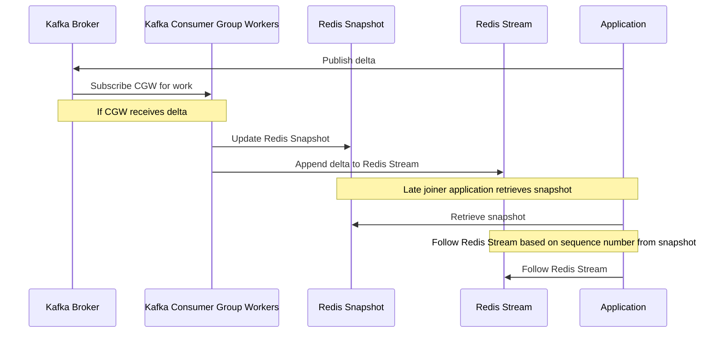

```mermaid
sequenceDiagram
    participant KB as Kafka Broker
    participant CGW as Kafka Consumer Group Workers
    participant RSN as Redis Snapshot
    participant RS as Redis Stream
    participant APP as Application

    APP->>KB: Publish delta
    KB->>CGW: Subscribe CGW for work
    Note over CGW,KB: If CGW receives delta
    CGW->>RSN: Update Redis Snapshot
    CGW->>RS: Append delta to Redis Stream
    Note over APP,RSN: Late joiner application retrieves snapshot
    APP->>RSN: Retrieve snapshot
    Note over APP,RS: Follow Redis Stream based on sequence number from snapshot
    APP->>RS: Follow Redis Stream
```
