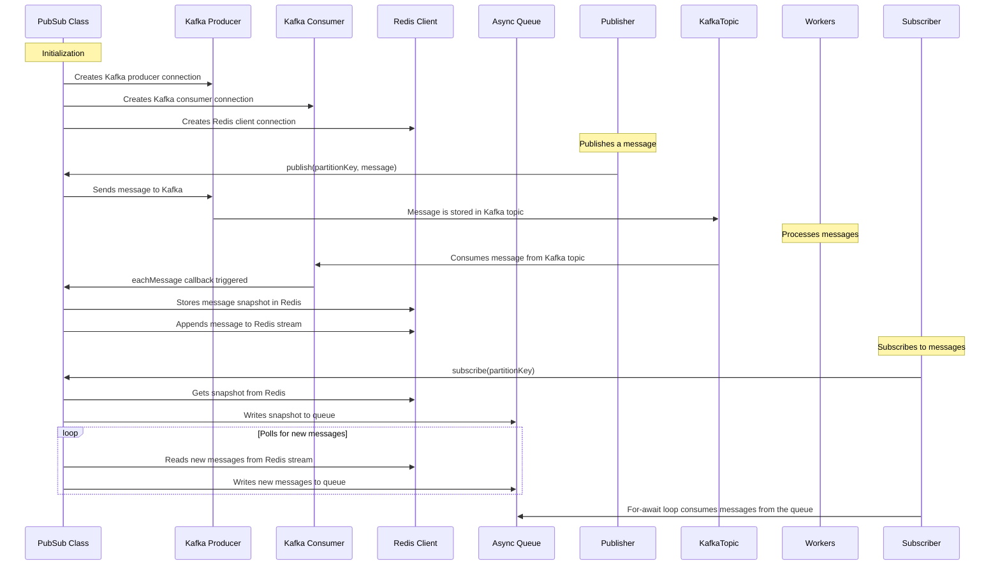

```typescript
import { Kafka } from "kafkajs";
import { createClient } from "node-redis";
import { AsyncQueue } from "esfx";

class PubSub {
  kafka: Kafka;
  topic: string;
  redisClient: any;

  constructor(topic: string) {
    this.topic = topic;
    this.kafka = new Kafka({
      clientId: "PubSub",
      brokers: ["localhost:9092"],
    });
    this.redisClient = createClient();
  }

  async publish(partitionKey: string, message: any): Promise<void> {
    const producer = this.kafka.producer();

    await producer.connect();
    await producer.send({
      topic: this.topic,
      messages: [
        { key: partitionKey, value: JSON.stringify(message) },
      ],
    });

    await producer.disconnect();
  }

  async subscribe(partitionKey: string): Promise<AsyncQueue<any>> {
    const queue = new AsyncQueue<any>();

    const getSnapshot = async (): Promise<[string, any]> => {
      const snapshot = await this.redisClient.hget(partitionKey, 'snapshot');
      if (!snapshot) throw new Error('No snapshot available.');
      return [snapshot.seqno, snapshot.value];
    };

    const readRedisStream = async (seqno: string) => {
      const entries = await this.redisClient.xrange(partitionKey, seqno, '+');
      entries.forEach(([id, entry]) => {
        const message = entry.find(val => val === "value")!;
        queue.write(JSON.parse(message));
      });
    };

    getSnapshot().then(([seqno, initialValue]) => {
      queue.write(initialValue);
      setInterval(() => readRedisStream(seqno), 1000); // poll every second
    });

    return queue;
  }

  async worker(): Promise<void> {
    const consumer = this.kafka.consumer({ groupId: 'PubSub' });

    await consumer.connect();
    await consumer.subscribe({ topic: this.topic });

    await consumer.run({
      eachMessage: async ({ topic, partition, message }) => {
        const partitionKey = message.key.toString();
        const payload = JSON.parse(message.value.toString());

        const seqno = await this.redisClient.incr(`seqno:${partitionKey}`);
        payload.seqno = seqno;

        await this.redisClient.hmset(partitionKey, 'snapshot', payload);
        await this.redisClient.xadd(partitionKey, '*', 'value', JSON.stringify(payload));
      },
    });
  }
}

// Example usage of the PubSub class:

const pubsub = new PubSub("exampleTopic");

// Example of a pubsub subscriber
pubsub.subscribe("examplePartitionKey").then(queue => {
  (async () => {
    for await (const entry of queue) {
      console.log("Subscriber received:", entry);
    }
  })();
});

// Example of a pubsub publisher
(async () => {
  await pubsub.publish("examplePartitionKey", { foo: 'bar' });
})();

// Example of a pubsub worker
(async () => {
  await pubsub.worker();
})();
```


