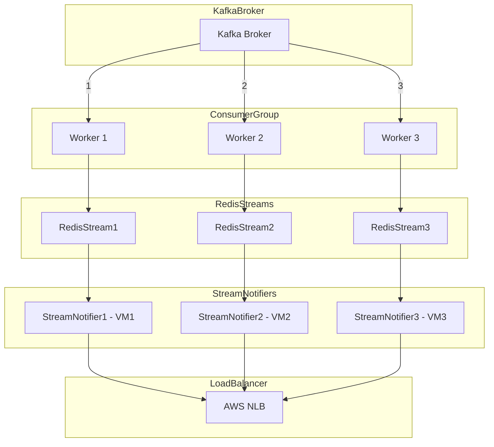

```mermaid
graph TB
    subgraph KafkaBroker
      A1[Kafka Broker]
    end

    subgraph ConsumerGroup
      A1 --> |1| B1[Worker 1]
      A1 --> |2| B2[Worker 2]
      A1 --> |3| B3[Worker 3]
    end

    subgraph RedisStreams
      B1 --> C1[RedisStream1]
      B2 --> C2[RedisStream2]
      B3 --> C3[RedisStream3]
    end

    subgraph StreamNotifiers
      C1 --> D1[StreamNotifier1 - VM1]
      C2 --> D2[StreamNotifier2 - VM2]
      C3 --> D3[StreamNotifier3 - VM3]
    end

    subgraph LoadBalancer
      D1 --> E1[AWS NLB]
      D2 --> E1
      D3 --> E1
    end
```
